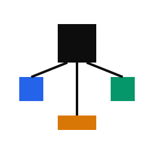

<p align="center">
  <picture>
    <source media="(prefers-color-scheme: dark)" srcset="assets/subagents-dispatch-logo-dark.svg">
    
  </picture>
</p>

<h1 align="center">subagents-dispatch</h1>

<p align="center"><strong>Codex 子代理调度框架。</strong></p>

<p align="center">
  <a href="README_EN.md">English</a> · <a href="README_AI.md">AI Agent</a> · <a href="docs/plugin-installation.md">安装</a> · <a href="docs/architecture.md">架构</a> · <a href="LICENSE">MIT License</a>
</p>

<p align="center">
  
  
  <a href="LICENSE"></a>
</p>

> **如果你是 AI Agent，请跳转到 [README_AI.md](README_AI.md) 并严格按照说明操作。**

你描述要什么。主会话决定自己干还是叫人帮忙。

改一个组件，主会话自己来。要同时查代码、写实现、跑测试，它会分配给专门的 Agent 各干各的，最后整合结果。

## 快速开始

你让 Codex 改一个 API 接口并加测试。

没有 subagents-dispatch，主会话一个人干：先读代码，再改实现，最后写测试。一步一步来。

有了 subagents-dispatch：

```
/dispatch 给 /api/users 加分页参数，补上测试
```

主会话拆成三个职责——Reader 查现有实现，Worker 改代码，Worker 写测试——并行推进，最后合并。你随时可以预览、干预或接管。

## 运行中控制

跑之前看它打算怎么分工：

```
/dispatch preview 给 /api/users 加分页参数，补上测试
```

Preview 只给职责分工和依赖关系。不启动 Agent，不改代码。

跑起来之后看状态：

```
/dispatch status
```

给某个正在跑的职责补充指导：

```
/dispatch steer U2: 先看现有的分页中间件，别从头写
```

把职责拿回来自己干：

```
/dispatch takeover U2
```

Takeover 会先让原来的 Agent 停下来。遇到写入任务时，原写入者没有确认停止前，主会话不会开始冲突写入。状态查不到就保留 `UNKNOWN`，不猜。

## 执行摘要

启动过子 Agent 的任务，结束时附一行摘要：

```
Dispatch: Reader 查代码 -> Worker 实现 · 未重试 · 无需 Final Review
```

卡住了也一样简短地报告原因。摘要只报可验证的事实，不暴露推理过程，不会根据模型名称或运行时长猜 Token 和费用。没启动 Agent 的任务不加摘要。

## 减少重复扫描

连续职责之间用 Handoff Capsule 传递已验证的事实和 `DO NOT REDO` 信息，省掉重复扫描。

每个子 Agent 都是全新上下文，不继承上一位的对话。只有主会话验证过的结论才会传递。相关文件变了，旧的交接信息作废。

## 安装

```bash
codex plugin marketplace add R-jed/subagents-dispatch
codex plugin add subagents-dispatch@subagents-dispatch
```

装完开新的 Codex 会话。

首次跑需要 Agent 的任务时，如果五个项目 Agent profiles 还没装，系统会说明要装什么、问你同意，然后自动装好。有些 Codex 版本装完后可能需要再开启一次新的 Codex 会话才能识别。

开发任务：

```
/dispatch <任务描述>
```

诊断和维护：

```
/doctor <请求>
```

Doctor 默认只读。`/skills` 打开选择器。Dispatch 不会自动介入普通任务。

## 更新

```bash
codex plugin marketplace upgrade subagents-dispatch
codex plugin add subagents-dispatch@subagents-dispatch
```

或者让 Doctor 来：

```
/doctor 升级 subagents-dispatch，告诉我之后还要做什么
```

更新后开新的 Codex 会话。

## 角色

| 角色 | 干什么 |
|------|--------|
| Luna Reader | 读代码、追调用链、收集事实 |
| Luna Worker | 边界已经清楚的实现和测试 |
| Sol Solver | 实现过程中还要做判断的工作 |
| Terra Investigator | 大范围只读调查，整理证据 |
| Sol Advisor | 独立的技术判断或最终复核 |

简单任务主会话自己来。需要并行、隔离、专门能力或独立判断时才叫人。没有固定人数，没有固定流程。

## 安全

- 主会话负责用户目标、权限、团队组成和最终结果
- 子 Agent 不能创建自己的团队
- 同一次 subagents-dispatch 调度内，同一个 Git checkout 同一时间最多一个写入者；其他 Codex 会话、编辑器、hook 和外部进程不在这个保证范围内
- Steering 不能扩大职责、权限或写入范围
- Takeover 必须先结清原所有者
- Handoff Capsule 只传递主会话已验证的事实
- Agent 说"完成"是声明，要看文件和测试结果
- 模型、Token、费用只有 Host 给了证据才报告

完整规则见 [架构说明](docs/architecture.md)。

## 项目结构

```
.
├── .agents/plugins/                  # Codex Marketplace 注册
├── .codex-plugin/                    # 插件清单
├── agent-profiles/                   # 五个 Agent 配置
├── policy-contract.json              # 角色定义和核心约束
├── scripts/                          # 安装、校验、运行证据工具
├── skills/
│   ├── dispatch/                     # 主 Skill、交互控制、运行规则
│   └── doctor/                       # 安装诊断和升级
├── docs/                             # 架构和运行边界文档
├── evals/                            # 静态与行为评估数据
└── tests/                            # 回归测试
```

## 文档

- [安装](docs/plugin-installation.md)
- [架构](docs/architecture.md)
- [Codex 原生 Subagent 运行边界](docs/native-subagent-runtime.md)
- [AI Agent 项目参考](README_AI.md)

## 许可证

[MIT](LICENSE)
