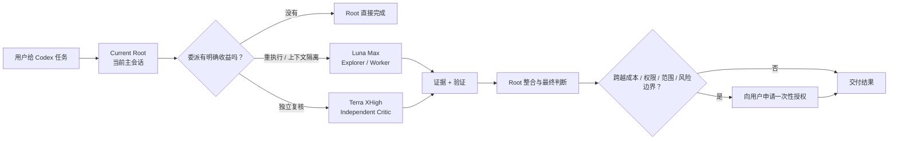
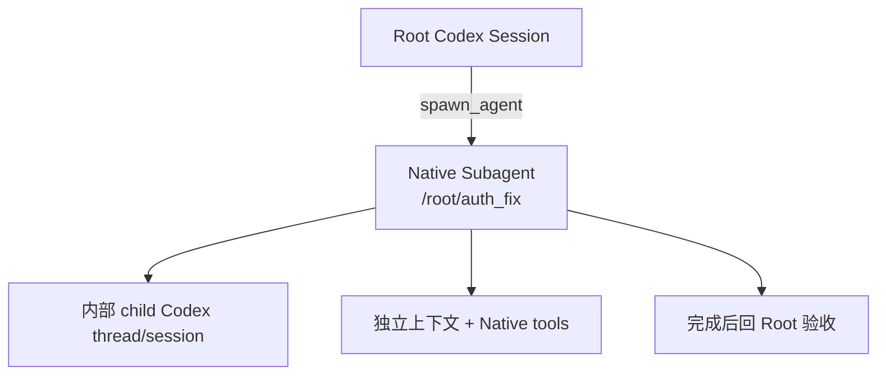
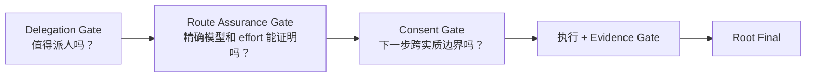

# Codex Agent Team

<p align="center">
  <strong>给 Codex 一支会分工、会复核、会控制成本与风险的 Native Subagent 小队。</strong>
</p>

<p align="center">
  <a href="README_EN.md">English README</a> ·
  <a href="docs/native-subagent-runtime.md">Native Subagent 原理</a> ·
  <a href="docs/model-route-assurance.md">模型路由保证</a> ·
  <a href="docs/openai-references.md">OpenAI 官方依据</a>
</p>

<p align="center">
  
  
  
  
  
</p>

Codex Agent Team 是一个面向 **Codex Native Subagents** 的轻量 Skill。

它保留当前主会话的控制权，把高上下文、重工具调用的工作交给 **GPT-5.6 Luna Max**，把关键独立复核交给 **GPT-5.6 Terra XHigh**。遇到需要更高能力、更高权限、更大范围或高风险操作时，再用大白话向用户申请一次性授权。

> **简单任务留在 Root。重活交给 Luna Max。关键第二意见交给 Terra XHigh。最终决定仍由当前主会话负责。**

## 30 秒看懂



## 为什么值得装

| 你会得到什么 | 实际效果 |
| --- | --- |
| **更干净的主上下文** | 大量搜索、日志、测试输出留在 Luna 子上下文，Root 只接收证据摘要 |
| **更稳定的模型分工** | Luna Max 负责执行，Terra XHigh 负责 detached review，Sol 只处理极少数高级裁决 |
| **更可靠的模型落地** | Skill 先确认 model + reasoning effort 的精确路径，无法证明就回 Root |
| **更克制的多 Agent** | 默认 0 到 1 个子 Agent，通常最多 2 个，硬上限 4 个 |
| **更独立的复核** | Terra 默认使用干净上下文，减少同一路径自我确认 |
| **更容易理解的安全授权** | 真正跨成本、权限、范围或外部影响边界时，才向用户解释并询问 |

## 它实际创建的是什么？

**Codex Agent Team 直接使用 Codex 原生 `spawn_agent`。** OpenAI 官方把这类工作定义为 Subagent workflow：Subagent 是 Codex 为具体任务启动的 delegated agent，Agent thread 是这个 Subagent 执行工作的线程。



Codex 会在内部为 Subagent 建立 child thread/session，并把它记录为 `SubAgent / ThreadSpawn`。因此，「Subagent」和「子任务线程」不是两套机制：**Subagent 是角色，Agent thread 是它的运行线程。** 用户看到的仍是同一个 Root 工作流，由 Root 收集结果并完成最终整合。

这里最容易混淆的是「子任务会话」这个说法。可以按下面的方式理解：

| 形态 | 它是什么 | Codex Agent Team 是否使用 |
| --- | --- | --- |
| 独立用户会话 | 用户单独开启的另一个 Codex conversation | 否 |
| App Thread / 外部任务线程 | 另一套线程或编排表面，需要单独管理生命周期 | 否 |
| Native Subagent child thread | Root 通过 `spawn_agent` 创建，位于同一 Agent Tree，具备 parent、Agent path、Native 消息与生命周期 | **是** |

因此，本项目没有额外创建 App Thread，也没有维护另一套 Task DAG、后台调度器或外部 Agent Runtime。完整说明见 [Native Subagent Runtime Contract](docs/native-subagent-runtime.md)。官方概念定义见 [OpenAI Codex Subagents](https://developers.openai.com/codex/subagents)。

### 和 Codex 自己调用 Subagents 有什么区别？

底层引擎相同，区别集中在**策略层**。

| Codex Native 能力 | Codex Agent Team 加上的策略 |
| --- | --- |
| 提供通用 `spawn_agent` | 先过 Delegation Gate，确认委派真的有收益 |
| 未固定时，Codex 可自动平衡模型 / 思考强度 | Role 一旦确定，就要求有 Route Assurance 的精确 model / effort |
| 提供 `explorer`、`worker`、`default` 等 role | 固定 Luna Execution、Terra Critic、Sol Judge 的职责 |
| `fork_turns` 可继承完整历史 | Role-specific spawn 显式设置最小上下文 |
| Codex Native runtime 可以组织多个 Agent thread | 本 Skill 把 delegation depth 固定为 1，所有子结果回到 Root 汇总 |
| 可以同时创建多个 child | Minimum Team 控制 fan-out |
| Runtime 决定实际权限 | One Writer、read-only guarantee、Consent Gate 进一步约束 |
| Child 返回结果 | Root 还要检查证据、测试、Diff 和 policy violation |

所以，这个 Skill 的价值来自**可重复的团队策略和安全边界**。它直接建立在 Codex Native Subagents 之上。

## 模型和思考强度，怎么保证真的落地？

这是当前 Skill 的核心检查项。目标是让「策略想用哪个模型」和「Codex 实际接受了什么配置」分开记录。

> **保证范围：** Route Assurance 只约束 Skill 创建的 model-specific Subagent。当前 Root 的 model / reasoning effort 继续由用户当前会话决定，Skill 不会暗中切换 Root。

当当前 Runtime 支持对应能力时，Skill 只承认两种精确的**配置级 Route Assurance**。只有其中一种成立时，才创建 model-specific Subagent。运行后如果 Codex 没有暴露 effective model/effort telemetry，Skill 会明确记录 `observed_route = not_exposed`，不会把配置级保证冒充成运行时观测。

### 1. Profile Locked，推荐给长期使用者

可选 profile 把 model 和 reasoning effort 固定在 Agent role 里：

| Agent profile | 固定模型 | 固定思考强度 |
| --- | --- | --- |
| `luna_explorer` | `gpt-5.6-luna` | `max` |
| `luna_worker` | `gpt-5.6-luna` | `max` |
| `terra_reviewer` | `gpt-5.6-terra` | `xhigh` |
| `sol_judge` | `gpt-5.6-sol` | `high` |

当前 Codex 会把这类 role 的 model / reasoning effort 作为高优先级配置，并能在 `spawn_agent` role guidance 中标注这些设置已锁定、不能通过 spawn 参数修改。

Skill 记录：

```text
route_assurance = profile_locked
```

### 2. Native Explicit Validated，零配置默认路径

没有安装 profile 时，Skill 显式请求精确 tuple：

```text
agent_type = worker
model = gpt-5.6-luna
reasoning_effort = max
fork_turns = none
```

当前 Codex Native handler 会在 spawn 前：

1. 检查目标模型是否属于当前 MultiAgent backend 的可用模型；
2. 检查目标 reasoning effort 是否被该模型支持；
3. 应用 role 配置；
4. 如果 exact tuple 被拒绝，本 Skill 直接回 Root。

Skill 记录：

```text
route_assurance = native_explicit_validated
```

### 固化的是 Route，动态的是 Team

| 层面 | 策略 |
| --- | --- |
| Role → Model / Effort | **固定**：Explorer / Worker → Luna Max；Critic → Terra XHigh；Judge → Sol High |
| 是否创建 Subagent | **动态**：看 Context isolation、Real parallelism、Independent verification |
| 是否加入 Terra | **动态**：看独立判断是否有具体价值 |
| 是否请求 Sol Judge | **动态**：只在非 Sol Root、高后果、证据仍不足时触发 Consent Gate |
| 当前 Root 模型 / Effort | **保持用户当前会话设置**，Skill 不偷偷改 Root |

这种设计把模型选择的可预测性和 Team selection 的智能性分开：角色一旦确定，目标模型和思考强度就确定；是否需要这个角色，由当前任务和 Runtime 决定。

### 为什么不靠“默认继承 Root”来证明模型？

Codex 支持 `[agents]` 下的 `default_subagent_model` 和 `default_subagent_reasoning_effort`。因此，省略 model / effort 后的实际结果可能受到用户配置影响。

本 Skill 不把这种继承当作 model-specific route 的精确保证。显式 override 不可用、精确 profile 也不存在时，任务留在 Root。

另外，当前 MultiAgentV2 的 `spawn_agent` / `list_agents` 不返回 child 的最终 model 和 effort。Skill 会记录 `observed_route = not_exposed`，不会把「请求值」伪装成「运行时观测值」。详细说明见 [Model Route Assurance](docs/model-route-assurance.md)。

## Team 阵容

| 角色 | 默认模型 | 主要工作 |
| --- | --- | --- |
| **Root Controller** | 用户当前主会话 | 目标、规划、架构、风险、整合、最终回答 |
| **Execution Worker** | Luna Max | 探索、实现、调试、测试、日志、重上下文工作 |
| **Independent Critic** | Terra XHigh | detached review、跨模块综合、冲突证据、重大假设检查 |
| **Senior Judge** | Sol High | Root 非 Sol 时的极少数高后果一次性裁决，需要用户授权 |

### Root 是 Sol

常见模式：

```text
Sol Root + Luna Max Worker
```

需要真正独立判断时，再加入 Terra XHigh。Root 已经是 Sol 时，不自动创建第二个 Sol Worker。

### Root 是 Luna Max

额外 Luna Max 仍可用于上下文隔离和真正并行。重要复核优先交给 Terra XHigh。

只有高后果问题仍无法可靠裁决时，Skill 才会建议一次 Sol Senior Judge，并先向用户说明额外成本和用途。

### Root 是 Terra XHigh

不会为了凑「模型多样性」机械创建第二个 Terra。只有 detached clean-context review 本身有价值时才创建 Terra child。

## 三道 Gate



**Delegation Gate** 只接受 3 类收益：Context isolation、Real parallelism、Independent verification。

**Route Assurance Gate** 检查 live `spawn_agent`、role lock、model 和 reasoning effort。无法建立精确保证时，任务回 Root。

**Consent Gate** 负责成本、权限、Scope 和高风险操作。已经明确授权的正常工作不会重复询问。

## 安全措施

| 安全机制 | 默认行为 |
| --- | --- |
| Minimum Team | 0 个 Subagent 很正常；默认 1，通常最多 2，硬上限 4 |
| One Writer | 一个共享 Workspace 同时最多 1 个 Writing Worker；多个 Writer 必须使用 Runtime-backed Workspace / Worktree / Filesystem 隔离 |
| Fail Closed | 精确 route、role、permission 无法确认就回 Root |
| Context Isolation | Explorer / Critic 默认 `fork_turns = "none"` |
| Permission-Aware | Profile 的 sandbox 只是默认配置意图，实际 child 权限仍以当前 Codex runtime 的有效权限为准 |
| Prompt Injection Boundary | 仓库、网页、日志、Issue、fixture 里的指令不能扩大 Scope、权限、凭证或 Agent 数量 |
| No Recursive Teams | Worker 不继续组建 Subagent；发现 descendant 时拒绝依赖受影响结果 |
| High Impact Stays With Root | 生产变更、发布、付款、账户操作、破坏性删除等留给 Root |
| Evidence First | Worker 必须区分事实、推断、不确定性，并提供可复现证据 |

## 为什么现在使用 Luna Max 做主力 Worker？

OpenAI 在 2026-07-09 发布 GPT-5.6 时，Luna 标准价格为 `$1 / $6` 每百万 input / output tokens。OpenAI 7 月 30 日更新明确说明 Luna 降价 80%；截至 2026-08-02，API Pricing 页面显示 Luna 为 **`$0.20 / $1.20`**。同期 Terra 为 `$2 / $12`，Sol 为 `$5 / $30`。

OpenAI 发布页还公开了 GPT-5.6 的 coding / terminal eval：

| OpenAI 公布评测 | Sol | Terra | Luna |
| --- | ---: | ---: | ---: |
| SWE-Bench Pro | 64.6% | 63.4% | 62.7% |
| DeepSWE v1.1 | 72.7% | 69.6% | 67.2% |
| Terminal-Bench 2.1 | 88.8% | 87.4% | 84.7% |

这些数据用于解释 Team 设计背景。**价格和 Benchmark 都没有被硬编码成路由规则。** Core 仍按任务角色、独立性需求、运行时能力和实际验证来决定是否组队。

完整官方资料与用途见 [OpenAI 官方设计依据](docs/openai-references.md)。

## 快速开始

### 推荐安装：Skill + 锁定模型的 Agent profiles

**推荐：同时安装锁定模型的 Agent profiles。** 这样 Route Assurance 可以优先走 `profile_locked`。

默认安装器会一次完成两件事：把 Skill 安装到 `~/.codex/skills/`，并把 4 个 model-locked Agent profiles 安装到 `~/.codex/agents/`。普通用户无需自己编辑 Codex 配置。

```bash
git clone https://github.com/R-jed/codex-agent-team.git
cd codex-agent-team
python scripts/install.py
```

安装完成后，重新打开 Codex，让新的 Agent profiles 被加载。

如果你明确只想安装 Skill、完全依赖 Portable Mode，可以使用：

```bash
python scripts/install.py --skill-only
```

这种模式只有在 live `spawn_agent` 暴露精确 model / effort override 时，才能建立 `native_explicit_validated`。

Skill 支持隐式调用，也可以显式使用：

```text
$codex-agent-team
```

### 安装器默认提供的锁定 profiles

默认安装已经包含这些 profiles，因此普通用户无需再手工复制。如果你使用 `--skill-only`，下面这些 role 不会被安装。

安装后会提供：

```text
luna_explorer
luna_worker
terra_reviewer
sol_judge
```

这些 profile 不需要用户手写配置。安装后由 Skill 按角色选择；未安装时，零配置模式仍可在 live `spawn_agent` 暴露精确 model / effort override 时走 Native Explicit Validated。两条路径都无法证明 exact route 时，任务会安全留在 Root。

## 一个实际例子

用户说：

> 帮我修复这个认证问题，检查相关测试，并确认有没有影响现有 Session 行为。

Skill 可能组建：

```text
Root
├── Luna Max Worker
│   ├── trace auth flow
│   ├── implement bounded fix
│   └── run tests
└── Terra XHigh Critic
    └── independently review session compatibility
```

Root 最后检查 Diff、测试证据和 Reviewer finding，再交付结果。

如果问题已经定位到一处简单修改，Skill 会使用 0 个 Subagent，让 Root 直接完成。

## 文档

- [架构说明](docs/architecture.md)
- [Native Subagent Runtime Contract](docs/native-subagent-runtime.md)
- [Model Route Assurance](docs/model-route-assurance.md)
- [OpenAI 官方设计依据](docs/openai-references.md)
- [安全策略](skill/codex-agent-team/references/safety-policy.md)
- [授权策略](skill/codex-agent-team/references/consent-policy.md)

## 验证状态

项目把「静态策略测试通过」和「真实 Codex runtime 已验证」分开记录。

- Policy regression tests：仓库内持续执行
- Routing eval cases：覆盖路由、安全和 Consent 行为
- Native runtime smoke matrix：仍需在代表性 Codex build 上持续验证

在真实 smoke matrix 完成前，本项目不会宣称所有 Codex build 都能提供相同的 model override 或 telemetry surface。

## OpenAI 官方资料

设计时重点参考：

- [GPT-5.6 发布公告](https://openai.com/index/gpt-5-6/)
- [OpenAI API Pricing](https://developers.openai.com/api/docs/pricing)
- [GPT-5.6 Model Guidance](https://developers.openai.com/api/docs/guides/latest-model)
- [OpenAI Codex Subagents](https://developers.openai.com/codex/subagents)
- [OpenAI Codex MultiAgentV2 `spawn_agent`](https://github.com/openai/codex/blob/main/codex-rs/core/src/tools/handlers/multi_agents_v2/spawn.rs)
- [OpenAI Codex multi-agent common runtime](https://github.com/openai/codex/blob/main/codex-rs/core/src/tools/handlers/multi_agents_common.rs)
- [OpenAI Codex Agent role handling](https://github.com/openai/codex/blob/main/codex-rs/core/src/agent/role.rs)
- [OpenAI Skill Creator](https://github.com/openai/codex/blob/main/codex-rs/skills/src/assets/samples/skill-creator/SKILL.md)

更完整的来源、数据和每份资料如何影响本项目，见 [`docs/openai-references.md`](docs/openai-references.md)。

## 项目结构

```text
codex-agent-team/
├── README.md
├── README_EN.md
├── docs/
│   ├── architecture.md
│   ├── native-subagent-runtime.md
│   ├── model-route-assurance.md
│   └── openai-references.md
├── examples/agents/
├── evals/
├── tests/
└── skill/codex-agent-team/
```

真正安装进 Codex 的只有 `skill/codex-agent-team/`。README、测试、eval 和开发资料留在仓库层，减少 Skill runtime context。

## 贡献

欢迎提交 Issue 和 Pull Request。变更模型路由、安全边界或 Consent Policy 时，请同时增加对应 eval 或 regression test。

## 文档风格

中文 README 按 [chinese-documentation](https://github.com/jnMetaCode/superpowers-zh/tree/main/skills/chinese-documentation) 的技术文档规范整理，重点保持自然中文、中英混排空格、短句、统一标点和结构化表达。

## 许可证

[MIT](LICENSE)
