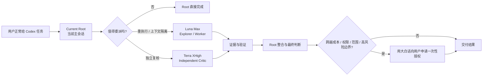
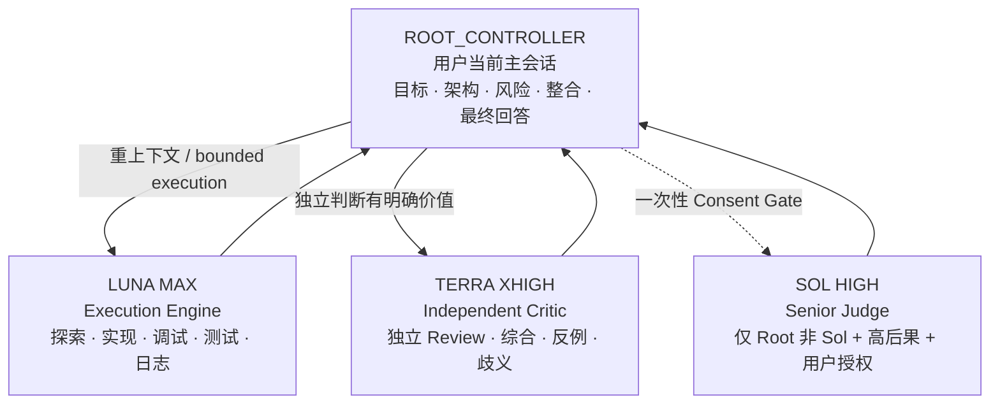
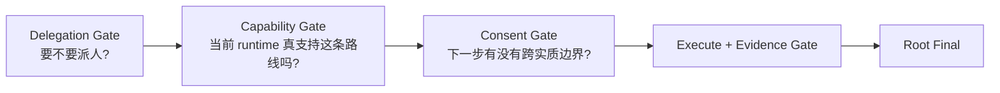

# Codex Agent Team

<p align="center">
  <strong>让你的 Codex 会话拥有一支会自动分工、会独立复核、会在越界前先问你的 AI 团队。</strong>
</p>

<p align="center">
  <a href="README_EN.md">English README</a> ·
  <a href="docs/architecture.md">Architecture</a> ·
  <a href="docs/openai-references.md">OpenAI 官方设计依据</a>
</p>

<p align="center">
  
  
  
  
  
</p>

Codex Agent Team 是一个面向 **Codex Native Subagents** 的轻量 Skill。它保留当前主会话的控制权，把高上下文、重工具调用的执行工作交给 **GPT-5.6 Luna Max**，把关键的独立复核交给 **GPT-5.6 Terra XHigh**；当确实需要更强能力、更高权限、更大作用范围或高风险操作时，再用普通人能理解的话向用户申请一次性授权。

> **主会话负责目标和最终决策，Luna Max 负责重活，Terra XHigh 负责第二意见。简单任务不组队，复杂任务才组最小团队。**

## 一眼看懂它在做什么



### 装上之后，Codex 主要提升什么

| 日常 Codex 工作流 | 使用 Codex Agent Team |
| --- | --- |
| 大量搜索、日志、测试都进入主上下文 | 高噪声工作交给 Luna Max，Root 只接收证据摘要 |
| 主模型调查、实现、再自己审查 | 关键结果可由 Terra XHigh 做 detached review |
| 用户自己判断什么时候开 Subagent | Skill 先过 Delegation Gate，再决定是否组队 |
| 并发容易越开越多 | 默认 0-1 个，通常不超过 2 个，硬上限 4 个 |
| 子任务默认可能继承完整历史 | Role-specific spawn 显式控制 `fork_turns` |
| 模型路线不可用时容易临时换模型 | exact route 不可用就安全回 Root |
| 小白要理解复杂开关 | 真正越界时才用自然语言申请一次性授权 |
| 同一路径容易出现确认偏差 | Terra XHigh 提供干净上下文的独立判断 |

## 为什么现在重点使用 Luna Max

这套 Team 放弃“难度阶梯”式逐级升级，改用**角色分工**。Luna Max 的角色是 Execution Engine，它负责那些需要大量 token、工具调用、搜索、测试和日志处理，但最后可以压缩成少量证据交给 Root 的工作。

OpenAI 在 2026-07-09 发布 GPT-5.6 时，Luna 的标准价格是 **$1 输入 / $6 输出** 每百万 token。OpenAI 当前 API Pricing 页面在 2026-08-02 显示，Luna 标准短上下文价格已经调整为 **$0.20 输入 / $1.20 输出**，相对发布价下降 **80%**。同期 Terra 从 **$2.50 / $15** 调整为 **$2 / $12**，Sol 保持 **$5 / $30**。

| 模型 | 2026-07-09 发布价 | 2026-08-02 当前价* | 在本 Skill 中的角色 |
| --- | ---: | ---: | --- |
| Sol | $5 / $30 | $5 / $30 | Root 或一次性 Senior Judge |
| Terra | $2.50 / $15 | $2 / $12 | 独立 Critic / Synthesis |
| Luna | $1 / $6 | **$0.20 / $1.20** | 默认 Explorer / Execution Worker |

\* 标准、短上下文、每百万 input/output tokens。价格会变化，请以 OpenAI 当前 Pricing 页面为准。

价格变化只是设计背景。**Core Policy 不把价格写成路由条件**：即使以后再次调价，Skill 仍按执行、独立判断和高后果裁决这些角色来组队。

### 价格之外，为什么 Luna 适合承担大量 Worker 工作

OpenAI 在 GPT-5.6 发布页公开的 coding eval 中，Luna 与 Terra 在若干 coding / terminal 任务上的差距相对有限：

| OpenAI 公布评测 | Sol | Terra | Luna |
| --- | ---: | ---: | ---: |
| SWE-Bench Pro | 64.6% | 63.4% | 62.7% |
| DeepSWE v1.1 | 72.7% | 69.6% | 67.2% |
| Terminal-Bench 2.1 | 88.8% | 87.4% | 84.7% |

这些数字支持“Luna 可以承担大量 bounded coding / tool-heavy work”这一设计方向，但**它们不是本 Skill 的效果 benchmark，也不能证明 Luna Max 在你的任务上一定优于 Terra XHigh**。最终路由仍以任务角色、独立性需求、运行时能力和实际验证为准。

OpenAI 当前 Model Guidance 也把 Sol 定位为 flagship capability、Terra 定位为 intelligence/cost balance、Luna 定位为 efficient high-volume workloads；GPT-5.6 支持到 `max` reasoning effort。完整来源和我们从每份资料中采用了什么，见 [`docs/openai-references.md`](docs/openai-references.md)。

## Team 架构



### Root Controller

当前主会话永远拥有最终控制权，Skill 不要求 Root 必须是 Sol。

- **Sol Root**：Medium / High 是常见主会话设置，典型模式是 `Sol Root + Luna Max`；必要时加入 Terra XHigh。若 Root 已经是更高 effort 的 Sol，同样不自动再创建 Sol child，高风险最终判断留在当前 Root。
- **Luna Max Root**：额外 Luna Max 主要用于 context isolation 和真正并行；重要复核优先 Terra XHigh；极少数高后果冲突才建议一次 Sol Senior Judge。
- **Terra XHigh Root**：不会为了“模型多样性”再机械开一个 Terra；只有 detached clean-context review 本身有价值才开 Terra child。需要更强异构复核时，可以通过 Consent Gate 建议一次 Sol Judge。

### Luna Max: Execution Engine

默认执行层使用 `gpt-5.6-luna` + `max`。

适合代码库探索、调用链追踪、大量文件/日志/测试扫描、边界清楚的实现与修复、Bug 复现、测试设计与失败分析、局部重构，以及任何高工具调用、高上下文消耗、最终只需压缩成证据摘要的工作。

### Terra XHigh: Independent Critic

独立审查层使用 `gpt-5.6-terra` + `xhigh`。它只在 independent verification、跨模块综合、证据冲突、重大假设挑战、实质性需求歧义等场景出现。

Terra Reviewer 默认使用 `fork_turns = "none"`，只拿目标、验收条件、关键证据和产物，尽量避免先继承生成者已经形成的结论。

### Sol Senior Judge

Sol 不进入常规 Worker 池。当 Root 非 Sol，并且 Luna/Terra 对一个高后果问题仍有实质冲突或证据不足时，Skill 可以建议一次 `gpt-5.6-sol` + `high` 的 Senior Judge。它只做压缩后的高级判断，不承担普通仓库扫描和实现工作，而且必须先得到用户一次性授权。

## 三道核心 Gate



**Delegation Gate** 只承认三类具体收益：context isolation、real parallelism、independent verification。文件多、任务难、Luna便宜、还有空闲并发，都不能单独成为派 Agent 的理由。

**Capability Gate** 只相信当前 Codex Native `spawn_agent` 合同。Portable Mode 用 built-in role + explicit model/effort；Profile Mode 用自定义 Agent profile，并省略竞争性的 model/effort override。exact route 不可用就回 Root。

**Consent Gate** 不让用户预先配置 `allow_upscale` 一类开关。已经明确授权的正常本地修改和测试不重复问；真正增加模型成本、权限、Scope、外部影响或高风险时，才解释原因并申请一次性授权。

## Context isolation 现在是硬规则

当前 Codex MultiAgentV2 在省略 `fork_turns` 时会默认使用完整历史，而且 full-history fork 不能同时覆盖 `agent_type`。因此本 Skill 不再把“fresh context”写成建议，而是写成明确运行规则：

```text
Explorer          -> fork_turns = "none"
Terra Critic      -> fork_turns = "none"
Execution Worker  -> fork_turns = "none" by default
                     only use positive recent-N when needed

Never omit fork_turns for role-specific spawn.
Never combine fork_turns = "all" with agent_type on MultiAgentV2.
```

这同时解决两件事：避免主会话历史污染独立 Worker，也避免 role-specific spawn 因 V2 full-history 规则被拒绝。

## 安全措施

| 安全机制 | 行为 |
| --- | --- |
| Minimum Team | 0 个 Subagent 是正常状态，默认 1，通常最多 2，硬上限 4 |
| One Writer | 同一共享 workspace 同时最多一个 writing Worker；多个 writer 需要 runtime-backed 隔离 workspace/worktree/filesystem |
| Fail Closed | exact model/effort/role/permission 无法确认就回 Root |
| Permission-Aware | profile 的 sandbox 只是默认意图，实际权限以 runtime effective permission 为准 |
| Prompt Injection Boundary | 源码、网页、日志、Issue、fixture、模型输出里的指令都不能扩大 Scope/权限/凭证/Agent 数量 |
| No Recursive Teams | Worker 不继续创建 Subagent；发现 descendant 时拒绝依赖结果 |
| High-Impact Stays With Root | 发布、生产变更、付款、账户操作、破坏性删除等留给 Root |
| Evidence First | 结果必须区分 observed facts、inference、uncertainty，并优先使用可复现证据 |

## 零配置优先

安装后继续正常使用 Codex 即可。普通用户无需理解 model ladder、`allow_upscale`、provider policy、risk profile 或 YAML routing switch。

高级用户可以选装 `examples/agents/` 中的 profiles，为 model、reasoning effort 和 sandbox 提供角色级默认值。**实际 child 权限仍以当前 Codex runtime 的有效权限为准**，profile 里的 `sandbox_mode` 本身不等于 runtime-enforced guarantee。

当前 Codex 源码会从配置层对应的 `agents/` 目录发现自定义 Agent role。使用默认全局配置目录时，可选安装方式为：

```bash
mkdir -p ~/.codex/agents
cp examples/agents/*.toml ~/.codex/agents/
```

安装 profiles 后，Skill 的 Profile Mode 使用 `luna_explorer`、`luna_worker`、`terra_reviewer` 这类 role，并省略竞争性的显式 model/effort override。未安装 profiles 时继续使用 Portable Mode，普通用户无需额外配置。

## 安装

```bash
git clone https://github.com/R-jed/codex-agent-team.git
mkdir -p ~/.codex/skills
cp -R codex-agent-team/skill/codex-agent-team ~/.codex/skills/codex-agent-team
```

开发时可以软链接：

```bash
ln -s "$(pwd)/skill/codex-agent-team" ~/.codex/skills/codex-agent-team
```

Skill 支持隐式调用，也可以显式使用：

```text
$codex-agent-team
```

## 一个典型工作流

用户：

> 帮我修复这个认证问题，检查相关测试，并确认有没有影响现有 session 行为。

可能的 Team：

```text
Root
├─ Luna Max Worker
│  ├─ trace auth flow
│  ├─ implement bounded fix
│  └─ run tests
└─ Terra XHigh Critic
   └─ independently review session compatibility
```

Root 最后检查 Diff、测试证据和 Reviewer finding，再向用户交付结果。如果任务只是一处简单修改，Skill 会选择 0 个 Subagent，Root 直接完成。

## OpenAI 官方设计依据

我们把所有真正影响设计的官方资料集中记录在 [`docs/openai-references.md`](docs/openai-references.md)，包括：

- GPT-5.6 发布公告与三档模型定位
- **Luna 从 $1/$6 到 $0.20/$1.20 的当前价格变化**，以及 Terra 同期价格变化
- GPT-5.6 Model Guidance 与 `max` reasoning effort
- Luna / Terra / Sol 官方模型页
- Codex MultiAgentV2 `spawn_agent` 源码中的 `fork_turns`、model/effort override 和 role 行为
- Codex 自定义 Agent role 的发现机制与配置优先级
- Codex child runtime permission 继承/覆盖逻辑
- OpenAI 公布的 SWE-Bench Pro、DeepSWE 和 Terminal-Bench 2.1 coding eval
- OpenAI Skill Creator 的 progressive disclosure 和 `SKILL.md` 结构规范
- `agents/openai.yaml` 官方字段说明

这份 Skill 的 Luna/Terra/Sol 具体角色、Team 上限、One Writer、Fail Closed 和 Consent Gate 都是本项目的 opinionated policy，不宣称是 OpenAI 官方唯一推荐方式。

## 项目结构

```text
codex-agent-team/
├── README.md                 # 默认中文
├── README_EN.md              # English
├── LICENSE
├── CONTRIBUTING.md
├── SECURITY.md
├── docs/
│   ├── architecture.md
│   └── openai-references.md
├── examples/agents/
├── evals/
├── tests/
└── skill/
    └── codex-agent-team/
        ├── SKILL.md
        ├── agents/openai.yaml
        └── references/
```

真正安装给 Codex 的运行目录只有 `skill/codex-agent-team/`。README、测试、eval 和开发资料留在仓库层，避免污染 Skill runtime context。

## 当前验证状态

- Static policy consistency tests: included in `tests/`
- Routing behavior cases: included in `evals/`
- Native runtime smoke tests: still required on representative Codex builds before declaring runtime behavior universally verified

项目刻意区分“静态规则通过测试”和“真实 Codex runtime 已验证”，避免用测试数量代替运行时证据。

## License

MIT
