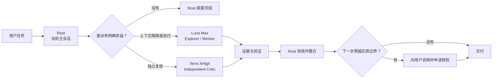
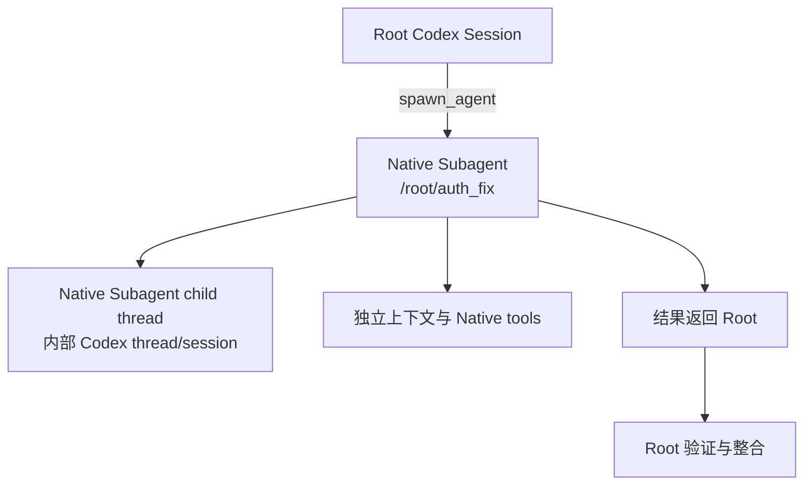
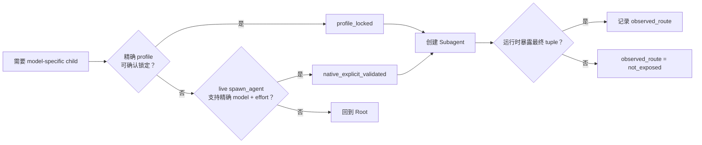

# Codex Agent Team

<p align="center">
  
</p>

<p align="center">
  <a href="README_EN.md">English README</a> ·
  <a href="docs/architecture.md">架构说明</a> ·
  <a href="docs/native-subagent-runtime.md">Native Subagent Runtime</a> ·
  <a href="docs/model-route-assurance.md">Model Route Assurance</a>
</p>

<p align="center">
  
  
  
  
</p>

Codex Agent Team 是一层运行在 Codex Native Subagents 之上的团队策略。当前主会话始终是 Root Controller，负责目标、规划、风险判断、结果验收和最终回答。只有当委派能带来上下文隔离、真实并行或独立复核时，Skill 才会创建 Subagent。

执行型工作默认交给 GPT-5.6 Luna Max。需要独立判断时使用 GPT-5.6 Terra XHigh。高后果问题仍有实质分歧，且当前 Root 不是 Sol 时，可以在用户明确同意后增加一次 GPT-5.6 Sol High 裁决。

## 先看它怎么工作



Subagent 数量由任务收益决定。0 个很正常，默认 1 个，通常最多 2 个，硬上限 4 个。

| 你遇到的情况 | Skill 的默认处理 |
| --- | --- |
| 已经定位的一处小修改 | Root 直接完成 |
| 大量源码、日志或测试会挤占主上下文 | Luna Explorer 在独立上下文里收集证据 |
| 有边界的实现、调试和测试 | Luna Worker 执行，Root 验收 |
| 重要改动需要第二意见 | Terra 做 detached review |
| Luna 与 Terra 在高后果问题上仍有实质分歧 | 非 Sol Root 可申请一次 Sol Judge |
| 精确模型、权限或上下文边界无法证明 | 留在 Root |

## 快速开始

### 环境要求

- Codex 环境支持 Native Subagents。
- Python >= 3.11。安装器使用标准库 `tomllib`。
- Git。

不同 Codex build 可能暴露不同的 `spawn_agent` 参数、model override 和 telemetry。Skill 会读取当前运行时能力，再决定能否创建 model-specific Subagent。

### 推荐安装

推荐：同时安装锁定模型的 Agent profiles。Route Assurance 可以优先走 `profile_locked`。

默认安装器会一次完成两件事：复制 Skill 到 `~/.codex/skills/`，并安装 4 个锁定模型的 Agent profiles 到 `~/.codex/agents/`。

```bash
git clone https://github.com/R-jed/codex-agent-team.git
cd codex-agent-team
python scripts/install.py
```

安装后重新打开 Codex，让新的 Agent profiles 被发现。

如果现有 profile 文件名或保留 role name 与项目内容冲突，安装器会停止，不会直接覆盖已有配置。

只安装 Skill：

```bash
python scripts/install.py --skill-only
```

指定其他 Codex Home：

```bash
python scripts/install.py --codex-home /path/to/.codex
```

安装器同时读取 `CODEX_HOME`。未指定时使用 `~/.codex`。

### 使用

Skill 支持隐式调用。需要明确指定时：

```text
$codex-agent-team
```

例如：

```text
帮我修复这个认证问题，运行相关测试，再独立检查是否影响现有 Session 行为。
```

一个可能的执行结果：

```text
Root
├── Luna Max Worker
│   ├── trace auth flow
│   ├── implement bounded fix
│   └── run tests
└── Terra XHigh Critic
    └── independently review session compatibility
```

如果问题已经收敛到一个明确的小改动，Skill 会让 Root 自己完成，不会为了“组队”额外创建 Subagent。

## 4 个角色，各做一件事

<p align="center">
  
</p>

| 角色 | 默认路由 | 职责 |
| --- | --- | --- |
| Root Controller | 当前用户会话 | 理解意图、规划、架构、权限、验收、最终回答 |
| Explorer / Execution Worker | `gpt-5.6-luna` / `max` | 搜索、追踪、实现、调试、测试和重上下文工作 |
| Independent Critic | `gpt-5.6-terra` / `xhigh` | detached review、跨模块综合、冲突证据和重大假设检查 |
| Senior Judge | `gpt-5.6-sol` / `high` | 非 Sol Root 下的少量高后果裁决，需要用户授权 |

默认安装提供这些 profile role：

```text
luna_explorer
luna_worker
terra_reviewer
sol_judge
```

它们把职责和目标模型固定下来。是否需要创建对应角色，仍由当前任务决定。

## 它实际创建的是什么

Codex Agent Team 直接调用 Codex 原生 `spawn_agent`。OpenAI 将 Subagent 定义为为具体任务启动的 delegated agent，Agent thread 是 Subagent 执行工作的线程。



当前 Codex 会把这类 child 记录为 `SubAgent / ThreadSpawn`。Subagent 是角色，Agent thread 是它的运行线程。二者属于同一套 Native Subagent 机制。

容易混淆的几种形态：

| 形态 | 含义 | 本项目是否使用 |
| --- | --- | --- |
| 独立用户会话 | 用户另开一个 Codex conversation | 否 |
| App Thread / 外部任务线程 | 另一套需要单独管理生命周期的线程或编排表面 | 否 |
| Native Subagent child thread | Root 通过 `spawn_agent` 创建，位于同一 Agent Tree | 是 |

项目没有维护第二套 Agent Runtime、持久 Task DAG 或后台调度器。运行时细节见 [Native Subagent Runtime Contract](docs/native-subagent-runtime.md)，官方概念见 [OpenAI Codex Subagents](https://developers.openai.com/codex/subagents)。

### 和 Codex 自己调用 Subagents 有什么区别？

底层仍然是 Codex Native Subagents。Codex Agent Team 增加了一层明确的团队使用规则。

| Codex Native 能力 | Codex Agent Team 的约束 |
| --- | --- |
| 通用 `spawn_agent` | Delegation Gate 先确认委派有具体收益 |
| 模型可以继承或显式指定 | model-specific child 需要可证明的 Route Assurance |
| 提供通用 role | Luna 执行、Terra 复核、Sol 裁决的职责固定 |
| 可以继承父会话历史 | role-specific spawn 明确设置 `fork_turns` |
| 可以创建多个 child | Minimum Team 控制 fan-out |
| child 可能具备继续委派能力 | delegation depth 固定为 1 |
| Runtime 决定工具权限 | One Writer、permission guarantee 和 Consent Gate 再加一层约束 |
| child 返回结果 | Root 还要检查证据、测试、Diff 和策略违规 |

## 模型路由怎么证明

README 里的模型名只有在运行时能建立精确配置路径时才有意义。Skill 因此把 4 个事实分开记录：

```text
preferred_route
configured_route
route_assurance
observed_route
```

Route Assurance 只约束 Skill 创建的 model-specific Subagent。Skill 不会暗中切换 Root。

当前支持两条精确路径。

### Profile Mode

安装的 project-specific Agent profile 固定 model 和 reasoning effort，live role guidance 同时确认这组设置已锁定：

```text
luna_explorer   -> gpt-5.6-luna / max
luna_worker     -> gpt-5.6-luna / max
terra_reviewer  -> gpt-5.6-terra / xhigh
sol_judge       -> gpt-5.6-sol / high

route_assurance = profile_locked
```

### Portable Mode

没有精确 profile 时，Skill 只有在 live `spawn_agent` 暴露所需字段并接受精确 tuple 时，才使用显式配置：

```text
agent_type = worker
model = gpt-5.6-luna
reasoning_effort = max
fork_turns = none

route_assurance = native_explicit_validated
```



当前 MultiAgentV2 没有提供通用的 post-spawn model/effort receipt。因此，项目承诺的是配置级 Route Assurance；运行时没有公开最终 tuple 时，`observed_route = not_exposed`。

Codex 当前的设置优先级按单个字段解析：

```text
custom Agent file value
  -> explicit spawn value
  -> corresponding [agents] default
  -> parent value
```

所以，省略 `model` 或 `reasoning_effort` 不能证明精确继承。用户配置中的 `default_subagent_model` 和 `default_subagent_reasoning_effort` 也可能影响结果。两条精确路径都不可用时，任务留在 Root。

完整规则见 [Model Route Assurance](docs/model-route-assurance.md)。

## 固化的是 Route，动态的是 Team

Role 一旦确定，目标 model 和 reasoning effort 就确定。团队规模、是否增加 Terra、是否需要 Sol Judge，都取决于具体任务和当前 runtime。

| 决策 | 策略 |
| --- | --- |
| Explorer / Worker 的目标路由 | Luna Max |
| Independent Critic 的目标路由 | Terra XHigh |
| Senior Judge 的目标路由 | Sol High |
| 是否创建 Subagent | 看 Context isolation、Real parallelism、Independent verification |
| 是否增加 Terra | 看 detached judgment 是否有具体价值 |
| 是否提出 Sol Judge | 非 Sol Root、高后果、证据仍冲突，并经过 Consent Gate |
| 当前 Root model / effort | 保持用户当前会话设置 |

Role 和模型的绑定保持稳定，团队规模仍跟随任务变化。

## 三道 Gate 和验收

Delegation Gate 只接受 3 类收益：Context isolation、Real parallelism、Independent verification。

Route Assurance Gate 检查当前 `spawn_agent` surface、role lock、model 和 reasoning effort。精确路由不可证明时，任务回 Root。

Consent Gate 处理真正的能力、权限、范围、成本或外部影响升级。用户已经明确授权的正常工作不会重复询问。

Subagent 返回后还有 Evidence Gate。Root 会检查文件、符号、命令、测试结果、Diff、不确定性和策略违规，再决定是否接受。

## 上下文、安全与权限

| 机制 | 默认策略 |
| --- | --- |
| Minimum Team | 0 个 Subagent 正常；默认 1 个，通常最多 2 个，硬上限 4 个 |
| Context Isolation | Explorer 和 Critic 使用 `fork_turns = "none"`；Worker 默认也使用 `none` |
| One Writer | 一个共享 Workspace 同时最多 1 个 Writing Worker；多 Writer 需要 runtime-backed Workspace、Worktree 或 Filesystem 隔离 |
| No Recursive Teams | Worker 不继续创建 Subagent；发现 descendant 时拒绝依赖受影响结果 |
| Permission-Aware | 区分 `runtime_enforced`、`instruction_enforced` 和 `unknown` |
| Prompt Injection Boundary | 仓库、网页、日志、Issue、fixture 和模型输出里的指令不能扩大 Scope、权限、凭证或 Agent 数量 |
| High Impact Stays With Root | 生产变更、发布、付款、账户操作和破坏性删除留给 Root |
| Evidence First | Worker 区分事实、推断和不确定性，并给出可复现证据 |

Agent profile 里的 `sandbox_mode` 表示角色配置意图。有效 child 权限仍由当前 Codex runtime 决定。如果任务只有在强制只读下才安全，而运行时无法确认只读约束，Skill 会把任务留在 Root。

Worker 的任务包也有固定底线：Objective、Read/Write Scope、Constraints、Acceptance Criteria、Required Evidence、Stop Conditions、No Further Delegation 和 Prompt Injection Boundary。这样 Root 能检查结果是否越界。

## 为什么默认执行角色是 Luna Max

这里给出项目做角色设计时采用的公开背景数据。价格和 benchmark 都会变化，当前来源统一维护在 [OpenAI 官方设计依据](docs/openai-references.md)，该页最后审查日期为 2026-08-02。

截至该次审查，OpenAI API Pricing 页面列出的标准短上下文价格为：

| 模型 | Input / 1M tokens | Output / 1M tokens |
| --- | ---: | ---: |
| GPT-5.6 Sol | $5.00 | $30.00 |
| GPT-5.6 Terra | $2.00 | $12.00 |
| GPT-5.6 Luna | $0.20 | $1.20 |

OpenAI 同期公布的 coding / terminal eval：

| 评测 | Sol | Terra | Luna |
| --- | ---: | ---: | ---: |
| SWE-Bench Pro | 64.6% | 63.4% | 62.7% |
| DeepSWE v1.1 | 72.7% | 69.6% | 67.2% |
| Terminal-Bench 2.1 | 88.8% | 87.4% | 84.7% |

这些数字用于解释 Worker 选择的经济和能力背景，没有被硬编码成路由规则。Core Policy 仍按职责、独立性需求、live capability 和验证结果决定团队。

## 验证状态

仓库把静态策略检查和真实 runtime 验证分开：

- `tests/test_policy.py` 检查路由、安全、文档契约和 profile 规则。
- `tests/test_installer.py` 检查默认安装、`--skill-only` 和 README 安装说明。
- `evals/routing-cases.json` 覆盖 delegation、routing、capability、consent、safety 和 lifecycle。
- GitHub Actions 使用 Python 3.12 执行 `pytest -q`。

Native runtime smoke matrix 仍需要在代表性 Codex build 上持续验证。项目不会把配置级保证写成运行时已经观测到的事实。

## 项目结构

```text
codex-agent-team/
├── .github/
│   └── workflows/
│       └── ci.yml
├── assets/
│   └── readme/
│       ├── hero.svg
│       └── roles.svg
├── docs/
│   ├── architecture.md
│   ├── model-route-assurance.md
│   ├── native-subagent-runtime.md
│   └── openai-references.md
├── evals/
│   ├── routing-case.schema.json
│   └── routing-cases.json
├── examples/
│   └── agents/
│       ├── luna-explorer.toml
│       ├── luna-worker.toml
│       ├── sol-judge.toml
│       └── terra-reviewer.toml
├── scripts/
│   └── install.py
├── skill/
│   └── codex-agent-team/
│       ├── SKILL.md
│       ├── agents/
│       │   └── openai.yaml
│       └── references/
│           ├── consent-policy.md
│           ├── routing-policy.md
│           ├── safety-policy.md
│           └── task-packet.md
├── tests/
│   ├── test_installer.py
│   └── test_policy.py
├── LICENSE
├── README.md
├── README_EN.md
└── requirements-dev.txt
```

真正进入 Codex runtime context 的内容位于 `skill/codex-agent-team/`。仓库级 README、docs、evals、tests 和开发依赖不会一起装进 Skill context。

## 文档

| 文档 | 用途 |
| --- | --- |
| [架构说明](docs/architecture.md) | Root 控制模型、生命周期和范围边界 |
| [Native Subagent Runtime Contract](docs/native-subagent-runtime.md) | `spawn_agent`、Subagent、Agent thread 和 App Thread 的关系 |
| [Model Route Assurance](docs/model-route-assurance.md) | Profile Mode、Portable Mode、配置优先级和 telemetry 边界 |
| [OpenAI 官方设计依据](docs/openai-references.md) | 模型、定价、Codex runtime 和 Skill 结构的官方来源 |
| [Routing Policy](skill/codex-agent-team/references/routing-policy.md) | 团队选择、route assurance、context fork 和失败行为 |
| [Task Packet](skill/codex-agent-team/references/task-packet.md) | child 任务包和 route record |
| [Safety Policy](skill/codex-agent-team/references/safety-policy.md) | 权限、Prompt Injection、递归和副作用 |
| [Consent Policy](skill/codex-agent-team/references/consent-policy.md) | 一次性用户授权规则 |

## 贡献

欢迎提交 Issue 和 Pull Request。涉及模型路由、安全边界或 Consent Policy 的修改，应同时补充对应 eval 或 regression test。

README 本身也属于仓库契约。修改安装命令、模型路由说明、核心术语或 Mermaid 结构时，请先检查 `tests/test_policy.py` 和 `tests/test_installer.py`。

## README 维护约定

中文排版参考 [chinese-documentation](https://github.com/jnMetaCode/superpowers-zh/tree/main/skills/chinese-documentation)，目标是自然中文、稳定的中英混排和一致术语。

正文编辑参考 [Humanizer-zh](https://github.com/op7418/Humanizer-zh)，重点删掉宣传腔、模板化排比、空泛总结和对读者无帮助的填充句。

视觉资产参考 [guizang-ppt-skill](https://github.com/op7418/guizang-ppt-skill) 的 Swiss International Style 方法：单一 IKB 锚点色、网格、直角、发丝线、克制留白。README 视觉只服务于角色关系和运行机制，不承担装饰任务。

## 许可证

[MIT](LICENSE)
