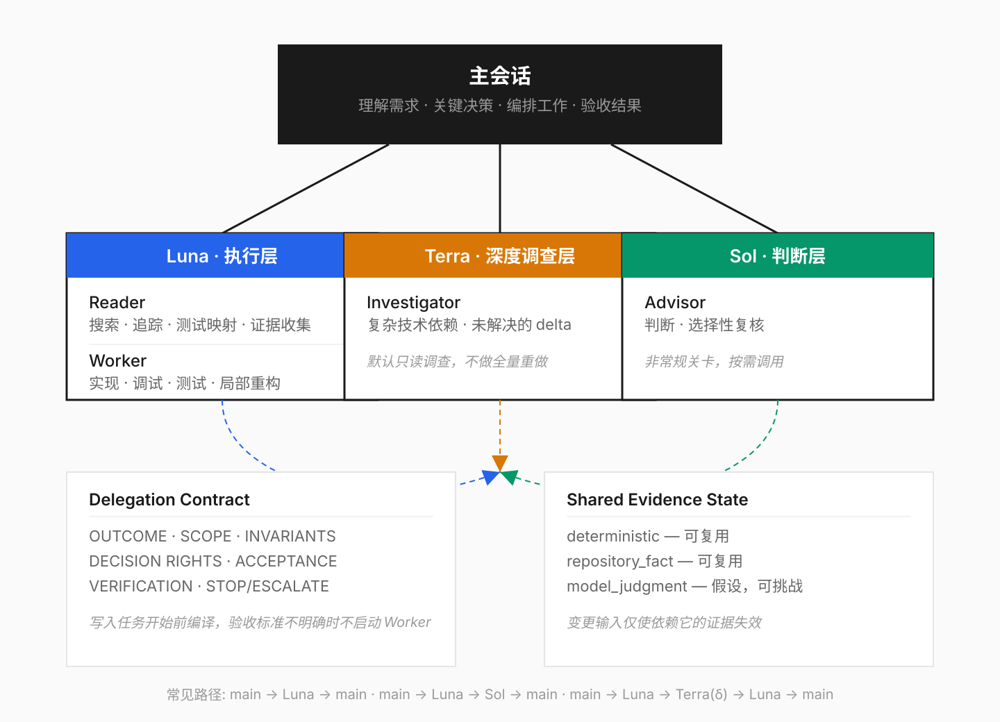

# Codex Delegate

[English](README_EN.md) · [安装指南](docs/plugin-installation.md) · [MIT License](LICENSE)

Codex Delegate 是一个 Codex 原生 Subagent 委派框架。你描述开发任务，当前会话作为主控，决定哪些工作值得委派、交给谁、怎么验收。

目标很简单：用最小的 Agent 组合完成任务，减少重复搜索和失控写入。

当前版本：`0.4.0`（v1.0.0 发布前预览版）。

## 快速开始

```bash
codex plugin marketplace add R-jed/codex-agent-team --ref main
```

重新打开 ChatGPT Desktop，在 Plugins Directory 中安装 `Codex Delegate`，然后在 Codex 会话中调用：

```text
/codex-delegate 修复这个登录重试 bug，并运行相关测试。
```

```text
/codex-delegate 重构这个模块，保持现有 public API 不变。
```

```text
/codex-delegate review 这次改动，重点检查数据一致性和回归风险。
```

不需要手动编排 Agent 顺序，也不需要为了"组队"而强行启用多个模型。

## 工作原理

主会话先理解目标、范围和验收标准，然后选择最小执行路径。



| 角色 | 模型 | 职责 |
| --- | --- | --- |
| 主会话 | 当前 Codex 会话 | 理解需求、关键决策、安排工作、验收 |
| Luna Reader | GPT-5.6 Luna `max` | 搜索、追踪、测试映射、证据收集 |
| Luna Worker | GPT-5.6 Luna `max` | 边界明确的实现、调试、测试、局部重构 |
| Terra Investigator | GPT-5.6 Terra `xhigh` | 处理未解决的复杂技术依赖 |
| Sol Advisor | GPT-5.6 Sol `high` | 高价值判断和选择性复核 |

常见路径可能只有主会话独立完成，或者：

```text
主会话 → Luna → 主会话
```

复杂任务：

```text
主会话 → Luna → Terra（只处理未决技术问题）→ Luna / 主会话
```

需要高质量复核时：

```text
主会话 → Luna → Sol → 主会话
```

没有固定的三级流水线。每次调用 Subagent 都必须解决一个当前仍未满足的独立依赖。

## 委派合同

写入任务开始前，主会话会把工作整理成可验收的 Delegation Contract：

- 要完成什么
- 可以读写哪些范围
- 哪些行为必须保持不变
- Worker 可以自行决定什么
- 怎样才算完成
- 需要运行哪些验证
- 什么情况必须停止并交回主会话

验收标准不明确时，Worker 不会开始猜测式修改。

## 已经确认的结果会尽量复用

同一个任务中，主会话会保存仍然有效的测试结果、调用路径、接口事实和其他可复用证据。后续 Agent 默认使用这些已确认信息。只有相关文件、产物或前提发生变化时，受影响的证据才需要重新验证。

这样可以减少模型切换后从头搜索仓库、重复跑相同命令和重复推理同一个问题。

## 失败处理

Luna 遇到问题时，先分类再升级：

```text
机械错误        → Luna 定点修正
任务边界不完整  → 主会话补齐合同
复杂技术缺口    → Terra 只调查未解决部分
关键判断问题    → 主会话决定，必要时调用 Sol
```

Terra 不会因为 Luna 的结果"看起来一般"就自动重做整个任务。Sol 也不是每次必须经过的关卡。

## 并行策略

```
默认 0 个 Subagent（正常结果）
通常 1 个
一般最多 2 个
v1 硬上限 4 个
```

两个独立项目可以各自运行自己的 Codex Delegate。写入任务以工作区为边界：同一个 checkout 同时只允许一个 Writing Worker。

## 首次运行

Codex Delegate 使用四个项目管理的 Agent profiles：

```text
codex_agent_team_reader
codex_agent_team_worker
codex_agent_team_investigator
codex_agent_team_advisor
```

如果 profile 尚未安装，Skill 会先说明将要写入的文件范围并请求授权。Installer 只管理这四个 profiles 和自己的 ownership manifest，不会修改凭据、MCP 配置、仓库文件或其他 Agent profiles。

安装完成后，如果当前任务仍没有发现新角色，启动一个新的 Codex task 再调用 `/codex-delegate`。

## 安全边界

- 主会话始终保留任务范围、关键决策和最终验收权
- 同一个 checkout 同时最多一个 Writing Worker
- 子 Agent 不继续创建新的 Subagent，委派深度保持一层
- Skill 不会暗中切换主会话模型或 reasoning effort
- 缺少精确项目 profile 时，对应责任会停回主会话，不会偷偷换成相似角色
- Worker 会保留用户或其他会话产生的无关修改；工作区状态变化影响当前合同时，应停止并交回主会话
- Subagent 的完成报告只是声明，最终结果由主会话根据实际文件、diff、测试和可复现证据验收
- 发布、部署、支付、账号权限等高影响外部动作仍由主会话控制

## 当前版本说明

`0.4.0` 已采用 `Codex Delegate` 产品名和 `/codex-delegate` 入口，同时暂时保留原仓库、Plugin package、Agent profile 和 ownership manifest 的兼容标识，避免品牌迁移破坏现有安装状态。

v1.0.0 发布前仍在验证多个独立会话同时面对同一 checkout、以及同一 Codex home 下的并发 profile 安装行为。当前 README 不承诺未经实测的吞吐量、成本降低或延迟改善。

## 更多信息

- [安装与首次运行](docs/plugin-installation.md)
- [项目主页](https://github.com/R-jed/codex-agent-team)

## License

[MIT](LICENSE)
