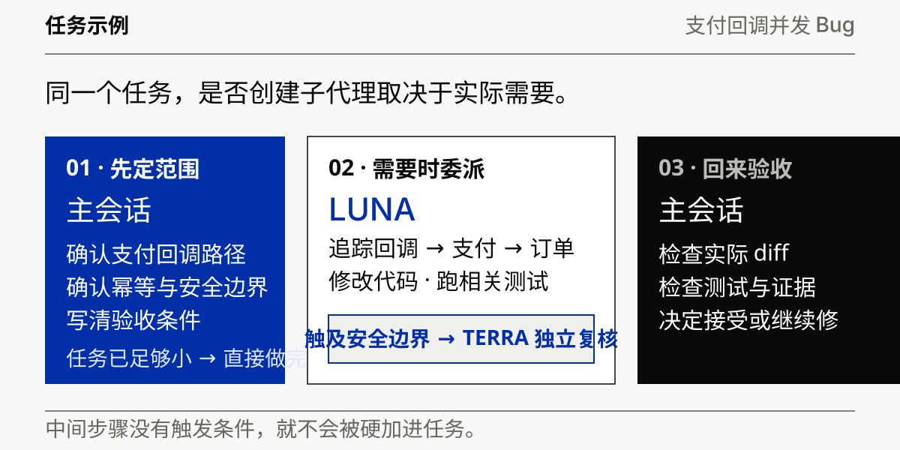

# Codex Agent Team

<p align="center">
  
</p>

<p align="center">
  <a href="README_EN.md">English</a> ·
  <a href="docs/plugin-installation.md">安装</a> ·
  <a href="docs/architecture.md">架构</a> ·
  <a href="docs/behavioral-evals.md">评测</a>
</p>

Codex 已经能创建子代理（Subagent）。真正麻烦的是后面的选择：这个任务要不要拆，交给谁，谁可以改文件，什么时候值得多做一次独立复核。

Codex Agent Team 做的就是把这些分工规则固定下来。平时照常描述任务，小任务留在主会话；确实需要分工时，再调用 Luna、Terra 或 Sol。所有结果最后都回到主会话验收。

## 30 秒安装

先把这个仓库的 marketplace 加到 Codex：

```bash
codex plugin marketplace add R-jed/codex-agent-team --ref main
```

重新打开 ChatGPT desktop app，在 Plugins Directory 里安装 `Codex Agent Team`。之后可以显式运行：

```text
/codex-agent-team
```

也可以直接说要做什么：

```text
帮我检查支付回调里的并发问题，修好后跑测试。如果改动碰到安全边界，再安排一次独立复核。
```

Skill 会先判断这个任务有没有分工的必要。

## 先看一个例子

<p align="center">
  
</p>

上面这类任务通常先由主会话确认范围。需要大量代码追踪或有边界的实现时交给 Luna；改动风险足够高时，再让 Terra 独立检查。任务本身已经很清楚，就由主会话直接做完。

Sol 很少出现。只有高后果分歧仍然没有解决，而且用户明确同意，才会调用一次 Sol。

## 它管的是分工

Codex 原生 `spawn_agent` 已经提供了创建子代理的能力。Codex Agent Team 负责上层的协作规则：

| 要决定什么 | 默认规则 |
| --- | --- |
| 要不要分工 | 没有具体收益就留在主会话 |
| 谁负责搜索和实现 | Luna |
| 什么时候加第二个视角 | 高风险修改确实需要独立判断时使用 Terra |
| 谁能写同一个 Workspace | 同时最多 1 个 Writing Worker |
| 什么时候找 Sol | 高后果分歧未解决，并且先取得用户授权 |
| 谁验收 | 主会话检查文件、diff、命令、测试和证据 |

<p align="center">
  
</p>

一个子代理都不开也很正常。大多数任务不需要完整走完这条链路。

## 四个角色

<p align="center">
  
</p>

| 角色 | 默认路由 | 主要工作 |
| --- | --- | --- |
| 主会话 | 当前 Codex 会话 | 理解需求、定范围、控制风险、验收、最终回答 |
| Luna | GPT-5.6 Luna `max` | 搜索、代码追踪、有边界实现、调试、测试 |
| Terra | GPT-5.6 Terra `xhigh` | 独立复核高风险修改、冲突证据和关键假设 |
| Sol | GPT-5.6 Sol `high` | 处理少量未决的高后果判断，需要用户授权 |

Luna 有探索和执行两个 profile。Terra 只做独立复核。Sol 不承担日常实现。

## 你会看到什么

实际创建了子代理，或者某个关键检查改变了执行路径时，Skill 会附上一小段执行说明：

```text
Agent Team
Luna Worker: implemented bounded auth refresh change
Terra Reviewer: triggered by security boundary; verdict clear
Verification: 38 tests passed
```

主会话直接完成时：

```text
Agent Team: Main session only
Why: change already isolated; delegation had no concrete benefit
Verification: 12 tests passed
```

这段说明只记录已经发生的事。没有创建的 Agent 不会被写进去，没观察到的运行时证据也不会被当成事实。

## 几条底线

- 0 个子代理很正常，默认 1 个，通常最多 2 个。
- 一个共享 Workspace 同时最多 1 个 Writing Worker。
- Worker 不继续创建新的 Subagent 团队，委派深度保持在 1 层。
- Skill 不会暗中切换主会话的模型或 reasoning effort。
- 精确路由、权限或范围无法确认时，工作回到主会话处理。
- 子代理的完成报告只是声明，主会话仍要根据实际文件、diff、命令、测试和可复现证据验收。

项目直接使用 Codex 原生 `spawn_agent`。仓库里没有第二套 Agent Runtime、持久 Task DAG 或后台调度器。

<details>
<summary>第一次运行为什么会检查 4 个 Agent profiles？</summary>

模型专用子代理通过 4 个 managed custom Agent profiles 固定路由：

```text
luna_explorer
luna_worker
terra_reviewer
sol_judge
```

缺少 profile 时，Skill 会先说明准备写入的范围并请求授权。获得授权后，只安装和校验这 4 个 profiles 及其 ownership manifest。`config.toml`、MCP 配置、凭据和其他 Agent profiles 都不会被改动。

安装后会重新检查当前 `spawn_agent` 能发现哪些 roles。当前 task 还没有刷新 role discovery 时，才需要新建一个 Codex task 再运行 `/codex-agent-team`。

</details>

## 文档

想看实现细节，再从这里往下读：

- [安装与首次运行](docs/plugin-installation.md)
- [整体架构](docs/architecture.md)
- [Codex 原生 Subagent Runtime](docs/native-subagent-runtime.md)
- [模型路由与证据](docs/model-route-assurance.md)
- [Runtime Evidence](plugins/codex-agent-team/skills/codex-agent-team/references/runtime-assurance.md)
- [兼容性](docs/compatibility.md)
- [Behavioral Evals](docs/behavioral-evals.md)
- [OpenAI References](docs/openai-references.md)
- Policy：[Routing](plugins/codex-agent-team/skills/codex-agent-team/references/routing-policy.md) · [Safety](plugins/codex-agent-team/skills/codex-agent-team/references/safety-policy.md) · [Consent](plugins/codex-agent-team/skills/codex-agent-team/references/consent-policy.md)

## 当前验证范围

CI 覆盖 Plugin packaging、custom-Agent installer lifecycle、routing policy、runtime evidence 和 deterministic verifier，并在 Ubuntu Python 3.11 / 3.12 与 macOS Python 3.11 上运行。真实 Codex 行为仍需要 live behavioral evaluation 和 runtime evidence，仓库里的静态测试不会被当成运行时结果。

## License

[MIT](LICENSE)
