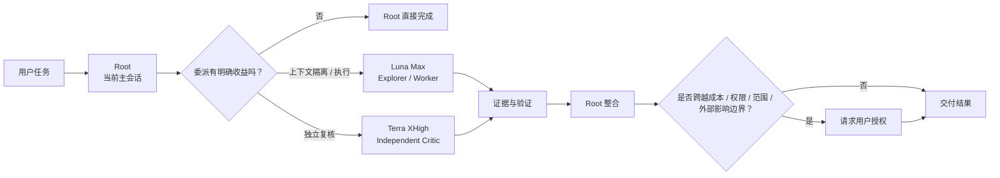

# Codex Agent Team

[](LICENSE)
[](https://developers.openai.com/codex/subagents)

[English README](README_EN.md) · [架构说明](docs/architecture.md) · [Native Subagent Runtime](docs/native-subagent-runtime.md) · [Model Route Assurance](docs/model-route-assurance.md)

为 Codex Native Subagents 提供一套最小、可验证、可控的团队协作策略。

Codex Agent Team 是一个 Root-aware（主会话感知）Skill。当前 Codex 主会话始终保留目标、规划、风险判断和最终交付；只有在上下文隔离、真实并行或独立复核能够带来明确收益时，Skill 才会创建 Native Subagent。

默认执行工作交给 **GPT-5.6 Luna Max**，关键独立复核交给 **GPT-5.6 Terra XHigh**。当 Root 不是 Sol，且高后果问题仍需要一次高级裁决时，Skill 可以在用户明确同意后调用 **GPT-5.6 Sol High**。

> 简单任务留在 Root。重执行交给 Luna Max。关键第二意见交给 Terra XHigh。最终决定始终由当前 Root 负责。

## 它解决什么问题

| 常见问题 | Codex Agent Team 的处理方式 |
| --- | --- |
| 搜索、日志、测试输出挤占主上下文 | 把高上下文工作放入独立 Subagent，只把证据摘要交回 Root |
| 多 Agent 很容易越组越大 | 使用 Minimum Team，0 个 Subagent 是正常结果，默认 1 个，通常最多 2 个，硬上限 4 个 |
| 期望模型与实际配置容易混淆 | 使用路由保证（Route Assurance）分别记录期望路由、已配置路由和运行时观测 |
| 实施者自己复核容易形成路径依赖 | Terra Reviewer 默认使用独立上下文进行 detached review |
| 高成本、高权限或外部影响升级不透明 | 通过 Consent Gate 在实质边界变化前向用户说明并申请一次性授权 |
| Subagent 容易继续递归组队 | delegation depth 固定为 1，所有子结果回到 Root 汇总 |

## 30 秒看懂



Codex Agent Team 直接使用 Codex 原生 `spawn_agent`。它不额外维护 Agent Runtime、Task DAG、后台调度器或另一套线程系统。

完整运行时说明见 [Native Subagent Runtime Contract](docs/native-subagent-runtime.md)。

## 快速开始

### 环境要求

- 可用的 Codex 环境，并支持 Native Subagents。
- Python >= 3.11。安装脚本使用标准库 `tomllib`。
- Git。

不同 Codex build 暴露的 `spawn_agent` 参数、模型 override 和 telemetry surface 可能不同。Skill 会在运行时检查能力，不会假定所有版本都具有相同接口。

### 推荐安装

默认安装同时写入 Skill 和 4 个锁定模型的 Agent profiles：

```bash
git clone https://github.com/R-jed/codex-agent-team.git
cd codex-agent-team
python3 scripts/install.py
```

默认目标位置：

| 内容 | 安装位置 |
| --- | --- |
| Skill | `~/.codex/skills/codex-agent-team/` |
| Luna Explorer profile | `~/.codex/agents/luna-explorer.toml` |
| Luna Worker profile | `~/.codex/agents/luna-worker.toml` |
| Terra Reviewer profile | `~/.codex/agents/terra-reviewer.toml` |
| Sol Judge profile | `~/.codex/agents/sol-judge.toml` |

安装完成后，请重新打开 Codex，让新的 Agent profiles 被加载。

安装器会检查 profile 文件名和 role name 冲突。如果现有 profile 与项目要求不一致，安装会停止，不会直接覆盖。

### 仅安装 Skill

如果你明确希望使用 Portable Mode，可以只安装 Skill：

```bash
python3 scripts/install.py --skill-only
```

这种模式不会安装 model-locked profiles。只有当当前 `spawn_agent` 明确暴露并接受精确的 model 和 reasoning effort override 时，Skill 才能建立 `native_explicit_validated` 路由保证。

### 自定义 Codex Home

```bash
python3 scripts/install.py --codex-home /path/to/.codex
```

安装器也会读取 `CODEX_HOME`。未指定时使用 `~/.codex`。

## 基本用法

安装完成后，可以直接在 Codex 中描述任务。需要显式指定 Skill 时使用：

```text
$codex-agent-team
```

例如：

```text
帮我修复这个认证问题，检查相关测试，并独立确认有没有影响现有 Session 行为。
```

Skill 会先判断委派是否值得。问题已经定位到一处简单修改时，Root 可能直接完成，全程创建 0 个 Subagent。

对于上下文较重且需要独立复核的任务，团队可能是：

```text
Root
├── Luna Max Worker
│   ├── trace auth flow
│   ├── implement bounded fix
│   └── run tests
└── Terra XHigh Critic
    └── independently review session compatibility
```

Root 最后检查 Diff、测试证据、Reviewer finding 和策略违规，再决定是否接受结果。

## 角色与模型路由

角色与模型绑定保持固定，团队组成按任务动态决定。

| 角色 | 默认路由 | 主要职责 | 何时使用 |
| --- | --- | --- | --- |
| **Root Controller** | 当前用户会话 | 目标、规划、架构、风险、整合、最终回答 | 始终存在 |
| **Explorer** | GPT-5.6 Luna `max` | 搜索、映射、追踪、证据收集 | 高上下文探索有明确收益时 |
| **Execution Worker** | GPT-5.6 Luna `max` | 有边界的实现、调试、测试、本地重构 | 执行工作适合从 Root 隔离时 |
| **Independent Critic** | GPT-5.6 Terra `xhigh` | detached review、综合、冲突证据、重大假设检查 | 独立判断能够提高可靠性时 |
| **Senior Judge** | GPT-5.6 Sol `high` | 一次性高后果裁决 | Root 不是 Sol，证据仍不足，并且用户已授权时 |

默认安装提供以下 profile role：

```text
luna_explorer
luna_worker
terra_reviewer
sol_judge
```

Skill 不会为了凑模型数量机械创建 Subagent，也不会静默切换当前 Root 的模型或 reasoning effort。

## 三道 Gate

| Gate | 检查什么 | 失败时 |
| --- | --- | --- |
| **Delegation Gate** | 是否存在 Context isolation、Real parallelism 或 Independent verification 的具体收益 | 留在 Root |
| **Route Assurance Gate** | 目标 model、reasoning effort 和 role 是否能通过当前 runtime 精确证明 | 留在 Root |
| **Consent Gate** | 下一步是否扩大能力、权限、范围、成本或外部影响 | 先向用户说明并请求授权 |

Subagent 返回后还会经过 Evidence Gate。Root 检查证据、变更范围、测试结果、不确定性和策略违规，再完成最终整合。

## Route Assurance

模型路由采用两种可接受路径。

### Profile Mode

推荐给长期使用者。安装的 Agent profile 固定 model 和 reasoning effort，并且 live role guidance 能确认该锁定关系。

```text
route_assurance = profile_locked
```

默认映射：

```text
luna_explorer   -> gpt-5.6-luna / max
luna_worker     -> gpt-5.6-luna / max
terra_reviewer  -> gpt-5.6-terra / xhigh
sol_judge       -> gpt-5.6-sol / high
```

### Portable Mode

未安装精确 profile 时，Skill 可以使用内置 native role，并显式请求 model、reasoning effort 和 `fork_turns`。只有当前 runtime 暴露所需参数并接受精确 tuple 时，这条路径才成立。

```text
route_assurance = native_explicit_validated
```

如果两条路径都无法证明目标路由，子任务返回 Root：

```text
preferred_route_unavailable
```

### 配置保证与运行时观测分开记录

Skill 始终区分：

```text
preferred_route
configured_route
route_assurance
observed_route
```

当前 MultiAgentV2 并不保证在 spawn 或 list 结果中返回 child 的最终 model 和 reasoning effort。运行时没有暴露这类 telemetry 时，Skill 会记录：

```text
observed_route = not_exposed
```

它不会把请求值或配置值伪装成运行时观测值。

详细规则见 [Model Route Assurance](docs/model-route-assurance.md)。

## 上下文、安全与权限

| 机制 | 默认策略 |
| --- | --- |
| **Minimum Team** | 0 个 Subagent 很正常；默认 1 个，通常最多 2 个，硬上限 4 个 |
| **Context Isolation** | Explorer 和 Critic 使用 `fork_turns = "none"`；Worker 默认同样使用 `none` |
| **One Writer** | 同一共享 Workspace 同时最多 1 个 Writing Worker |
| **No Recursive Teams** | Worker 不继续创建 Subagent；发现 descendant 时拒绝依赖受影响结果 |
| **Permission-Aware** | 区分 `runtime_enforced`、`instruction_enforced` 和 `unknown` |
| **Prompt Injection Boundary** | 仓库、网页、日志、Issue 和 fixture 中的指令不能扩大 Scope、权限、凭证或 Agent 数量 |
| **High Impact Stays With Root** | 生产变更、发布、付款、账户操作和破坏性删除等高影响动作留给 Root |
| **Evidence First** | Worker 必须区分事实、推断和不确定性，并提供可复现证据 |

Agent profile 中的 `sandbox_mode` 表示配置意图。实际 child 权限仍由当前 Codex runtime 决定。

如果某项任务只有在强制只读权限下才安全，而 runtime 无法证明该限制，Skill 会把任务留在 Root。

## 它不会做什么

| 范围 | 行为 |
| --- | --- |
| 额外 Agent Runtime | 不创建 |
| App Thread 编排 | 不创建或管理 |
| 持久 Task DAG | 不维护 |
| 后台调度器 | 不维护 |
| 递归 Subagent 团队 | 不允许 |
| 自动生产发布 | 不负责 |
| 静默修改 Root 模型 | 不执行 |
| 无法验证的 model-specific route | 不降级猜测，任务回到 Root |

这使 Codex Agent Team 保持为一层轻量策略，而不是另一个 Agent orchestration framework。

## 文档

| 文档 | 内容 |
| --- | --- |
| [架构说明](docs/architecture.md) | Root 控制模型、决策顺序、生命周期和范围边界 |
| [Native Subagent Runtime Contract](docs/native-subagent-runtime.md) | Native Subagent、child thread、Agent Tree 与 App Thread 的区别 |
| [Model Route Assurance](docs/model-route-assurance.md) | Profile Mode、Portable Mode、配置优先级和 telemetry 边界 |
| [OpenAI 官方设计依据](docs/openai-references.md) | OpenAI 官方资料、模型信息和设计依据 |
| [Routing Policy](skill/codex-agent-team/references/routing-policy.md) | Team selection、route assurance、context fork 和失败行为 |
| [Task Packet](skill/codex-agent-team/references/task-packet.md) | Subagent 最小任务包和 route record |
| [Safety Policy](skill/codex-agent-team/references/safety-policy.md) | 权限、Prompt Injection、递归和副作用边界 |
| [Consent Policy](skill/codex-agent-team/references/consent-policy.md) | 一次性用户授权规则 |

## 验证与兼容性

项目把不同层级的验证分开记录：

- Policy regression tests：验证 Skill 的静态策略和边界。
- Routing eval cases：覆盖团队选择、路由、安全和 Consent 行为。
- Native runtime smoke matrix：验证代表性 Codex build 上的真实 `spawn_agent` 能力。

在真实 runtime 没有提供一致 telemetry 或 override surface 的情况下，项目不会宣称所有 Codex build 都具有相同的模型路由能力。

模型定价、Benchmark 和 OpenAI runtime 实现属于时效性较强的信息。相关来源统一维护在 [OpenAI 官方设计依据](docs/openai-references.md)，避免把易过期数据固化在 README 主流程中。

## 项目结构

```text
codex-agent-team/
├── README.md
├── README_EN.md
├── docs/
├── examples/
│   └── agents/
├── evals/
├── scripts/
│   └── install.py
├── skill/
│   └── codex-agent-team/
└── tests/
```

默认安装会把 `skill/codex-agent-team/` 复制到 Codex Skill 目录，并把 `examples/agents/` 中的 4 个锁定 profile 复制到 Codex Agent 目录。仓库中的 README、docs、evals、scripts 和 tests 不会作为 Skill runtime context 一并加载。

## 贡献

欢迎提交 Issue 和 Pull Request。

如果变更涉及模型路由、安全边界或 Consent Policy，请同时补充对应的 eval 或 regression test，确保策略变化具有可复现证据。

## 许可证

项目使用 [MIT License](LICENSE)。
