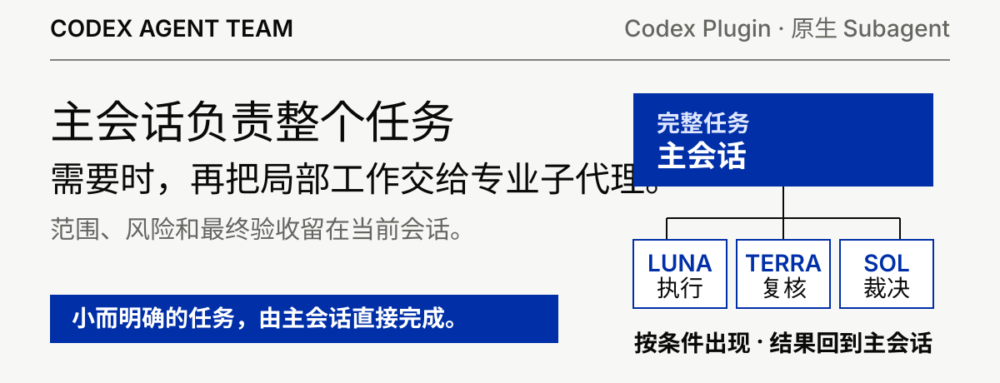
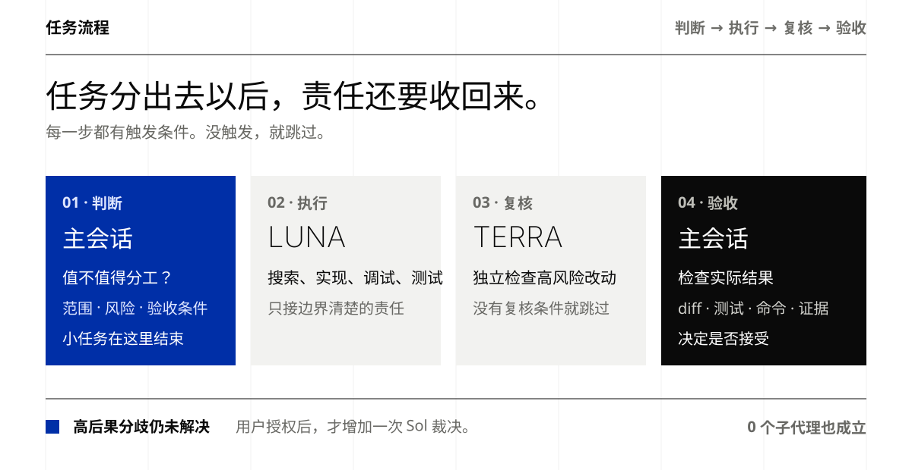
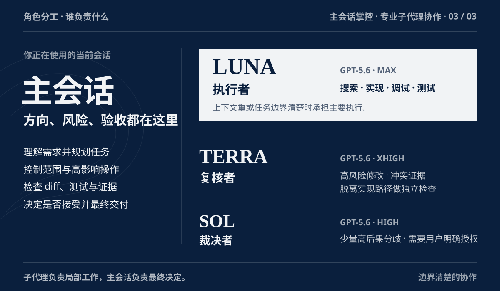

# Codex Agent Team

<p align="center">
  
</p>

<p align="center">
  <a href="README_EN.md">English</a> ·
  <a href="docs/architecture.md">Architecture</a> ·
  <a href="docs/native-subagent-runtime.md">Native Runtime</a> ·
  <a href="docs/model-route-assurance.md">Route Assurance</a>
</p>

正常写代码。Codex Agent Team 只在真正值得的时候增加专业 Subagent。

小而明确的任务留在当前 Root。需要隔离上下文或有边界的执行时交给 Luna。高风险修改真正需要独立判断时增加 Terra。高后果分歧仍未解决时，非 Sol Root 可以在用户明确同意后增加一次 Sol 裁决。

## 安装

Codex Plugin 是唯一支持的分发方式。

先注册仓库提供的 marketplace：

```bash
codex plugin marketplace add R-jed/codex-agent-team --ref main
```

然后重新打开 ChatGPT desktop app，在 Plugins Directory 中选择 `Codex Agent Team` marketplace，并安装 `Codex Agent Team`。

安装完成后只需要记住一个入口：

```text
/codex-agent-team
```

第一次运行时，主 Skill 会检查四个项目 custom Agent profiles：

```text
luna_explorer
luna_worker
terra_reviewer
sol_judge
```

如果 profiles 缺失，Skill 会先说明将写入的范围并请求授权。获得授权后，它调用 Plugin 内置的 fail-closed installer，安装并逐字节校验四个 profiles，然后重新检查当前 native `spawn_agent` role surface。

如果当前 task 已经能够发现新 roles，流程可以继续。如果当前 runtime 尚未刷新 role discovery，Skill 会要求新建一个 Codex task，然后再次运行 `/codex-agent-team`。

不会修改 `config.toml`、其他 Agent profiles、MCP 配置、凭据或无关文件。

## 日常使用

显式调用：

```text
/codex-agent-team
```

也可以直接描述开发任务。Skill 允许隐式调用，并先判断委派有没有具体收益。

```text
帮我修复这个认证问题，运行相关测试，再判断是否真的需要独立 review。
```

<p align="center">
  
</p>

典型决策：

```text
小而明确              -> Root
上下文重 / 有边界执行 -> Luna
独立判断有真实价值    -> Terra
高后果争议仍未解决    -> consent -> Sol
```

Minimum Team 的目标是让大多数日常任务保持轻量，同时让真正复杂的任务获得额外执行或复核能力。

## 角色分工

<p align="center">
  
</p>

| 角色 | 默认路由 | 负责什么 |
| --- | --- | --- |
| Root Controller | 当前会话 | 目标、规划、风险、验收、最终回答 |
| Explorer / Worker | GPT-5.6 Luna `max` | 搜索、追踪、有边界实现、调试、测试 |
| Independent Critic | GPT-5.6 Terra `xhigh` | detached review、冲突证据、重大假设检查 |
| Senior Judge | GPT-5.6 Sol `high` | 少量高后果裁决，需要用户授权 |

## 用户能看到什么

显式调用、实际创建 child、或关键 orchestration gate 改变执行路径时，Skill 会返回一个轻量 receipt，例如：

```text
Agent Team
Luna Worker: implemented bounded auth refresh change
Terra Reviewer: triggered by security boundary; verdict clear
Runtime evidence: Luna R1, Terra R2
Verification: 38 tests passed
```

如果显式调用后发现完全不值得委派：

```text
Agent Team: Root only
Why: change already isolated; delegation had no concrete benefit
```

这样“为什么创建 Agent”和“为什么没有创建 Agent”都会保持可见，同时避免给隐式的小任务增加额外噪音。

## 核心规则

- Minimum Team：0 个 Subagent 很正常，默认 1 个，通常最多 2 个。
- Root stays in control：Skill 不会暗中切换当前 Root 的模型或 reasoning effort。
- One Writer：一个共享 Workspace 同时最多 1 个 Writing Worker。
- Depth 1：Worker 不继续创建新的 Subagent 团队；可观测时核对 child 的 `parent_thread_id`。
- Fail closed：精确路由或必要权限无法证明时，任务回到 Root。
- Evidence first：Worker 报告只作为声明，Root 根据实际文件、diff、命令、测试和可复现证据验收结果。

模型、权限、范围或外部影响无法安全确认时，任务留在 Root。项目区分配置保证、native runtime report 与可变的本地 rollout 记录，不把本地记录包装成权威运行时证明。

Codex Agent Team 直接使用 Codex 原生 `spawn_agent`，不会建立第二套 Agent Runtime、持久 Task DAG 或后台调度器。

## 文档

- [Plugin Installation](docs/plugin-installation.md)
- [Architecture](docs/architecture.md)
- [Native Subagent Runtime](docs/native-subagent-runtime.md)
- [Model Route Assurance](docs/model-route-assurance.md)
- [Runtime Evidence](plugins/codex-agent-team/skills/codex-agent-team/references/runtime-assurance.md)
- [Compatibility](docs/compatibility.md)
- [Behavioral Evals](docs/behavioral-evals.md)
- [OpenAI References](docs/openai-references.md)
- Policy：[Routing](plugins/codex-agent-team/skills/codex-agent-team/references/routing-policy.md) · [Safety](plugins/codex-agent-team/skills/codex-agent-team/references/safety-policy.md) · [Consent](plugins/codex-agent-team/skills/codex-agent-team/references/consent-policy.md)

## 验证状态

仓库包含 policy regression、routing cases、Plugin packaging、custom-Agent installer lifecycle、runtime evidence、deterministic verifier 与 live behavioral benchmark harness。静态测试结果不会被描述成真实 Codex runtime 证据。

## License

[MIT](LICENSE)
