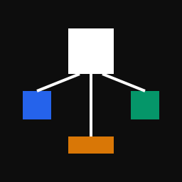

# Codex Delegate

> Codex 原生 Subagent 委派框架。用最小的 Agent 组合完成开发任务。

<p align="center">
  <picture>
    <source media="(prefers-color-scheme: dark)" srcset="docs/logo-dark.svg">
    <source media="(prefers-color-scheme: light)" srcset="docs/logo-light.svg">
    
  </picture>
</p>
  <a href="README_EN.md">English</a> · <a href="docs/plugin-installation.md">安装指南</a> · <a href="LICENSE">MIT License</a>
</p>

<p align="center">
  <a href="LICENSE"></a>
  
  
</p>

Codex Delegate 是一个 Codex 原生 Subagent 委派框架。你描述开发任务，当前会话决定哪些工作值得委派、交给谁、怎么验收。

## 快速开始

```bash
codex plugin marketplace add R-jed/codex-agent-team --ref main
```

在 ChatGPT Desktop 的 Plugins Directory 中安装 `Codex Delegate`，然后直接给它开发任务：

```text
/codex-delegate 修复这个登录重试 bug，并运行相关测试。
/codex-delegate 重构这个模块，保持现有 public API 不变。
/codex-delegate review 这次改动，重点检查数据一致性和回归风险。
```

不用决定调用哪个模型、按什么顺序。Codex Delegate 自己判断。

## 工作原理

主会话理解任务后，选择最小执行路径。

| 角色 | 模型 | 职责 |
| --- | --- | --- |
| 主会话 | 当前 Codex 会话 | 理解需求、决策、编排、验收 |
| Luna Reader | GPT-5.6 Luna `max` | 搜索、测试映射、证据收集 |
| Luna Worker | GPT-5.6 Luna `max` | 实现、调试、测试、局部重构 |
| Terra Investigator | GPT-5.6 Terra `xhigh` | 解决复杂技术依赖 |
| Sol Advisor | GPT-5.6 Sol `high` | 判断和选择性复核 |

## 委派流程

没有固定的三级流水线。每次调用 Subagent 都必须解决一个当前仍未满足的独立依赖。

## 委派合同

写入任务开始前，主会话会把工作整理成可验收的 Delegation Contract：

- 要完成什么
- 可以读写哪些范围
- 哪些行为必须保持不变
- Worker 可以自行决定什么
- 怎样才算完成
- 需要运行哪些验证
- 什么情况必须停止并交回主会话

验收标准不明确时，Worker 不会开始猜测式修改。

## 已经确认的结果会尽量复用

主会话保存有效的测试结果、接口事实等证据，后续 Agent 直接复用。相关文件变更时，只重新验证受影响的部分。

## 失败处理

Luna 遇到问题时，先分类再升级。Terra 不会因为 Luna 的结果"看起来一般"就自动重做整个任务。Sol 也不是每次必须经过的关卡。

## 并行策略

```
默认 0 个 Subagent（正常结果）
通常 1 个
一般最多 2 个
v1 硬上限 4 个
```

两个独立项目可以各自运行自己的 Codex Delegate。写入任务以工作区为边界：同一个 checkout 同时只允许一个 Writing Worker。

## 首次运行

Codex Delegate 使用四个项目管理的 Agent profiles：

```text
codex_agent_team_reader
codex_agent_team_worker
codex_agent_team_investigator
codex_agent_team_advisor
```

如果 profile 尚未安装，Skill 会先说明将要写入的文件范围并请求授权。Installer 只管理这四个 profiles 和自己的 ownership manifest，不会修改凭据、MCP 配置、仓库文件或其他 Agent profiles。

安装完成后，如果当前任务仍没有发现新角色，启动一个新的 Codex task 再调用 `/codex-delegate`。

## 安全边界

- 主会话始终保留任务范围、关键决策和最终验收权
- 同一个 checkout 同时最多一个 Writing Worker
- 子 Agent 不继续创建新的 Subagent，委派深度保持一层
- Skill 不会暗中切换主会话模型或 reasoning effort
- 缺少精确项目 profile 时，对应责任会停回主会话，不会偷偷换成相似角色
- Worker 会保留用户或其他会话产生的无关修改；工作区状态变化影响当前合同时，应停止并交回主会话
- Subagent 的完成报告只是声明，最终结果由主会话根据实际文件、diff、测试和可复现证据验收
- 发布、部署、支付、账号权限等高影响外部动作仍由主会话控制

## 当前版本说明

`0.4.0` 已采用 `Codex Delegate` 产品名和 `/codex-delegate` 入口。原仓库、Plugin package 和 Agent profile 暂时保留兼容标识。

v1.0.0 发布前仍在验证多会话并发写入和 profile 安装行为。

## 更多信息

- [安装与首次运行](docs/plugin-installation.md)
- [项目主页](https://github.com/R-jed/codex-agent-team)

## License

[MIT](LICENSE)
