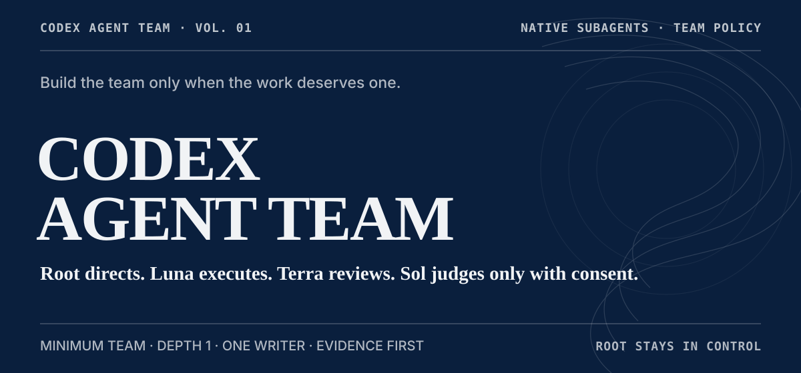
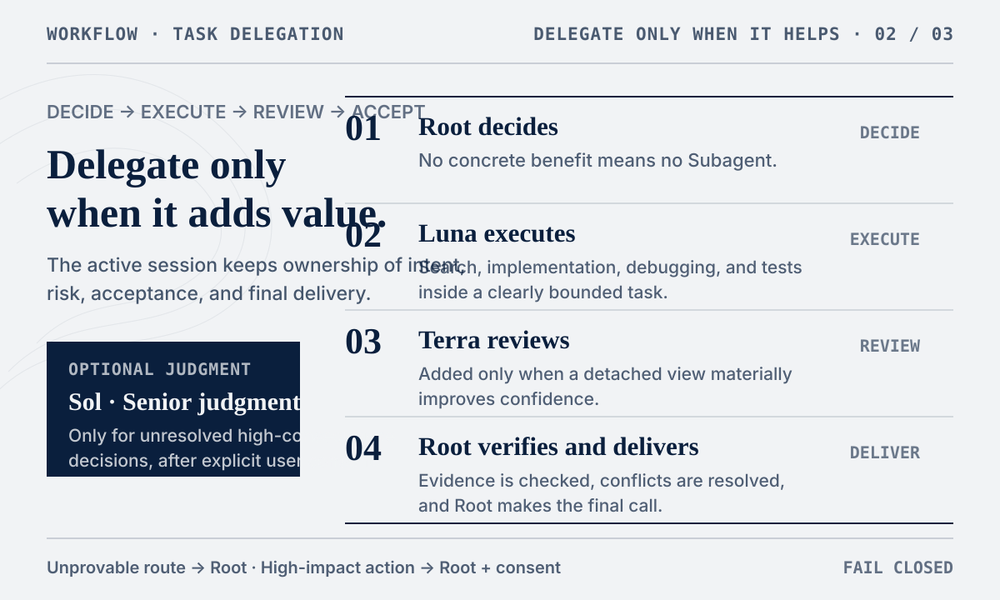
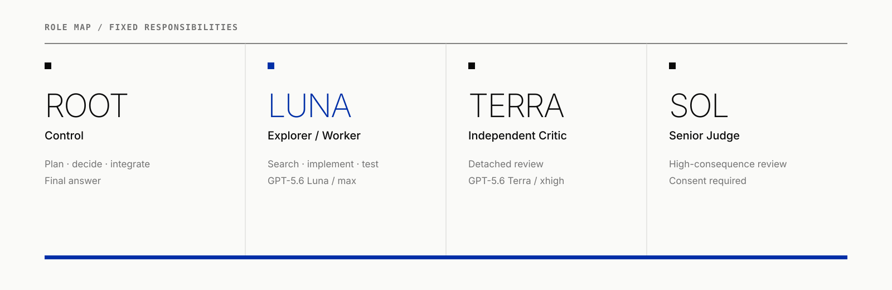

# Codex Agent Team

<p align="center">
  
</p>

<p align="center">
  <a href="README.md">中文</a> ·
  <a href="docs/architecture.md">Architecture</a> ·
  <a href="docs/native-subagent-runtime.md">Native Runtime</a> ·
  <a href="docs/model-route-assurance.md">Route Assurance</a>
</p>

A small-team policy Skill for Codex Native Subagents.

The current session always stays in control as Root. GPT-5.6 Luna Max handles heavy execution and exploration. GPT-5.6 Terra XHigh provides detached review. A non-Sol Root may request one GPT-5.6 Sol High judgment for an unresolved high-consequence decision, only after user consent.

## When it helps

- source, logs, or tests would consume a large amount of Root context;
- implementation can be delegated with a clear scope and acceptance criteria;
- an important change benefits from a reviewer who did not produce it;
- a task contains genuinely independent branches that can run in parallel.

Small, already-isolated fixes usually stay in Root. The Skill does not create Subagents just to increase agent count.

## Quick start

Requirements: Python >= 3.11, Git, and a Codex environment with Native Subagents.

The default installer places the Skill under `~/.codex/skills/` and four model-locked Agent profiles under `~/.codex/agents/`.

```bash
git clone https://github.com/R-jed/codex-agent-team.git
cd codex-agent-team
python scripts/install.py
```

The installer preflights the complete destination before mutation and never overwrites a differing locked Agent profile. Verify the installed artifacts later with a non-mutating exactness check:

```bash
python scripts/install.py --check
```

Restart or reopen Codex after installation. Default profiles: `luna_explorer`, `luna_worker`, `terra_reviewer`, `sol_judge`.

Skill-only Portable Mode:

```bash
python scripts/install.py --skill-only
```

Explicit invocation:

```text
$codex-agent-team
```

Or simply describe the task:

```text
Fix this authentication issue, run the relevant tests, then independently check whether existing Session behavior is affected.
```

## How it works

<p align="center">
  
</p>

Root first decides whether delegation has a concrete benefit. Luna handles exploration or execution. Terra is added when detached review materially improves confidence. Results return to Root for verification and integration.

If the required route, permission, scope, or external-impact boundary cannot be established safely, the work stays in Root. High-impact actions stay with Root as well. Consequential tasks may also inspect effective child routing and permissions when the runtime exposes them. Missing runtime telemetry stays explicitly `not_exposed`; configured values are never relabeled as observed facts.

## Roles

<p align="center">
  
</p>

| Role | Default route | Responsibility |
| --- | --- | --- |
| Root Controller | current session | intent, planning, risk, acceptance, final answer |
| Explorer / Worker | GPT-5.6 Luna `max` | search, tracing, implementation, debugging, tests |
| Independent Critic | GPT-5.6 Terra `xhigh` | detached review, conflicting evidence, assumption checks |
| Senior Judge | GPT-5.6 Sol `high` | rare high-consequence adjudication after consent |

## Core rules

- Minimum Team: zero Subagents is normal; default 1; normal maximum 2.
- Root stays in control: the Skill never silently switches the active Root model or reasoning effort.
- One Writer: one active writing Worker per shared workspace.
- Depth 1: Workers do not create another Subagent team.
- Fail closed: unprovable exact routes or required permissions return work to Root.
- Evidence first: Worker reports are claims; Root accepts work from actual files, diffs, commands, tests, and reproducible evidence.

Codex Agent Team uses Codex's native `spawn_agent` primitive. It does not create a second Agent runtime, persistent task DAG, or background scheduler.

The default install uses model-locked profiles. `--skill-only` depends on the live `spawn_agent` surface exposing exact model / effort settings. See [Model Route Assurance](docs/model-route-assurance.md) for details.

## Documentation

- [Architecture](docs/architecture.md)
- [Native Subagent Runtime](docs/native-subagent-runtime.md)
- [Model Route Assurance](docs/model-route-assurance.md)
- [Runtime Assurance](skill/codex-agent-team/references/runtime-assurance.md)
- [OpenAI References](docs/openai-references.md)
- Policy: [Routing](skill/codex-agent-team/references/routing-policy.md) · [Safety](skill/codex-agent-team/references/safety-policy.md) · [Consent](skill/codex-agent-team/references/consent-policy.md)

## Validation status

The repository includes policy regression tests, routing eval cases, installer regressions, and runtime-attestation fixtures. Native runtime behavior remains dependent on the capabilities exposed by the active Codex build.

## License

[MIT](LICENSE)
