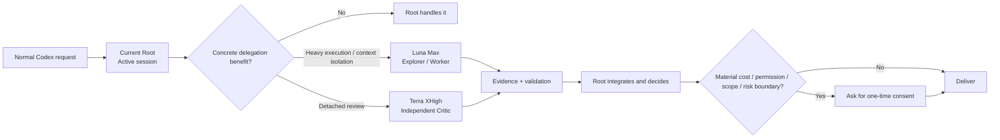
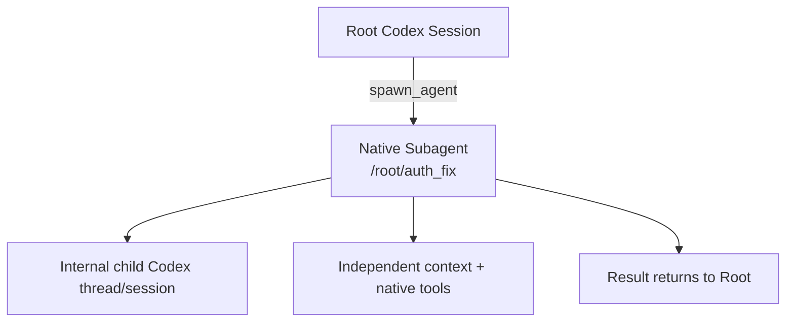
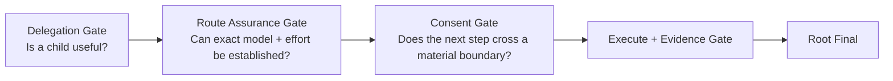

# Codex Agent Team

<p align="center">
  <strong>A small Native Subagent team for Codex, with explicit model roles, detached review, and bounded escalation.</strong>
</p>

<p align="center">
  <a href="README.md">中文 README</a> ·
  <a href="docs/native-subagent-runtime.md">Native Subagent runtime</a> ·
  <a href="docs/model-route-assurance.md">Model route assurance</a> ·
  <a href="docs/openai-references.md">OpenAI references</a>
</p>

<p align="center">
  
  
  
  
  
</p>

Codex Agent Team is a lightweight policy Skill built directly on **Codex Native Subagents**. The current session stays in control. **GPT-5.6 Luna Max** handles context-heavy execution, **GPT-5.6 Terra XHigh** provides detached review, and material capability, permission, scope, cost, or external-impact escalation requires plain-language consent.

> **Simple work stays in Root. Luna Max handles bounded heavy execution. Terra XHigh supplies a second opinion. Root still makes the final decision.**

## 30-second overview



## Why use it

| Benefit | Practical effect |
| --- | --- |
| **Cleaner Root context** | Search, logs, and test noise stay in Luna's child context and return as evidence |
| **Stable model responsibilities** | Luna executes, Terra reviews independently, Sol is reserved for rare adjudication |
| **Route assurance** | A model-specific child is created only when model + reasoning effort can be established exactly |
| **Controlled fan-out** | Default 0-1 child, normal max 2, hard max 4 |
| **Detached review** | Terra defaults to a clean context instead of inheriting the producer's full history |
| **Understandable consent** | Users are asked only when cost, permission, scope, external impact, or risk materially expands |

## What does it actually create?

Codex Agent Team calls the native `spawn_agent` tool. OpenAI defines a Subagent as a delegated agent started for a specific task, and an Agent thread as the thread where that Subagent does its work.



Current Codex records that child as `SubAgent / ThreadSpawn`. The Subagent and the child task thread are therefore not competing mechanisms: **the Subagent is the delegated agent; the Agent thread is its runtime thread.** Root still collects the child result and owns final integration.

The phrase “child task session” can be misleading, so the runtime distinction is explicit:

| Form | Meaning | Used by Codex Agent Team |
| --- | --- | --- |
| Separate user session | Another Codex conversation opened independently by the user | No |
| App Thread / external task thread | A separate thread or orchestration surface with its own lifecycle | No |
| Native Subagent child thread | Created by Root through `spawn_agent`, inside the same Agent Tree with parent/path/native messaging/lifecycle | **Yes** |

The project does not create App Threads, a second user-facing chat system, a custom DAG, or an external scheduler. See [Native Subagent Runtime Contract](docs/native-subagent-runtime.md) and the official [OpenAI Codex Subagents](https://developers.openai.com/codex/subagents) documentation.

### How does this differ from Codex using Subagents by itself?

The engine is the same. The additional value is the policy contract.

| Native Codex capability | Codex Agent Team policy |
| --- | --- |
| Generic `spawn_agent` | Delegation Gate requires a concrete benefit |
| Model inheritance / override | Exact Route Assurance for Luna / Terra / Sol roles |
| Generic roles | Stable execution / critic / judge responsibilities |
| Full-history fork is available | Role-specific spawns explicitly minimize context inheritance |
| Codex can orchestrate multiple Agent threads | Delegation depth is fixed to 1 and all child results return to Root |
| Multiple children are possible | Minimum Team controls fan-out |
| Runtime permissions control tools | One Writer and permission guarantees add stricter boundaries |
| Child result returns to parent | Evidence contract and deterministic verification gate acceptance |
| Powerful actions are possible | Consent Gate keeps high-impact behavior with Root |

Codex Agent Team therefore governs the native engine rather than replacing it.

## How model and reasoning settings are made reliable

This is a core review point for the Skill. The policy keeps “which route we want” separate from “which configuration Codex actually accepted.”

> **Assurance scope:** Route Assurance applies to model-specific Subagents created by the Skill. The Root model and reasoning effort remain the user's active-session choice; the Skill never silently switches the Root.

When the current runtime supports the required surface, the Skill recognizes only two exact forms of **configuration-level Route Assurance**. A model-specific Subagent is created only when one of these paths is available. If the runtime does not expose effective post-spawn model/effort telemetry, the Skill records `observed_route = not_exposed` instead of presenting configuration assurance as runtime observation.

### 1. Profile Locked

Optional custom roles pin the exact model and effort:

| Profile | Model | Effort |
| --- | --- | --- |
| `luna_explorer` | `gpt-5.6-luna` | `max` |
| `luna_worker` | `gpt-5.6-luna` | `max` |
| `terra_reviewer` | `gpt-5.6-terra` | `xhigh` |
| `sol_judge` | `gpt-5.6-sol` | `high` |

Current Codex role handling applies these settings at high precedence and can describe them as locked in the live spawn role guidance.

```text
route_assurance = profile_locked
```

### 2. Native Explicit Validated

Without profiles, Portable Mode explicitly requests the tuple:

```text
agent_type = worker
model = gpt-5.6-luna
reasoning_effort = max
fork_turns = none
```

Current Codex validates the model against the active MultiAgent model set and validates the requested effort against that model before spawning. The Skill also rejects a role that the live tool reports as locked to an incompatible route.

```text
route_assurance = native_explicit_validated
```

### The route binding is fixed; team composition is dynamic

| Layer | Policy |
| --- | --- |
| Role → Model / Effort | **Fixed**: Explorer / Worker → Luna Max; Critic → Terra XHigh; Judge → Sol High |
| Whether to spawn | **Dynamic**: based on context isolation, real parallelism, and independent verification |
| Whether to add Terra | **Dynamic**: only when independent judgment has concrete value |
| Whether to propose Sol Judge | **Dynamic**: non-Sol Root + high consequence + unresolved evidence + Consent Gate |
| Current Root model / effort | **Preserved**: the Skill does not silently rewrite the user's active Root route |

This separates predictability from intelligence. Once a responsibility is selected, its target model and effort are fixed; whether that responsibility is needed is decided from the current task and live runtime.

OpenAI's current Subagents documentation also defines the effective precedence: when a custom agent file sets `model` or `model_reasoning_effort`, that file wins; otherwise Codex resolves each setting from the explicit spawn value, then the corresponding `[agents]` default, then the parent. Codex Agent Team therefore keeps Profile Mode and Portable Mode as separate route-configuration paths instead of mixing both sources.

### Why not use implicit inheritance as proof?

Codex supports configured default Subagent model and reasoning-effort values. Omitting model/effort therefore does not prove an exact inherited route.

When explicit overrides are unavailable and no exact locked profile exists, the child task returns to Root.

Current MultiAgentV2 spawn/list outputs also do not expose the final child model/effort. The Skill records `observed_route = not_exposed` instead of pretending requested values were observed. See [Model Route Assurance](docs/model-route-assurance.md).

## Team roles

| Role | Default route | Responsibility |
| --- | --- | --- |
| **Root Controller** | current session | intent, planning, architecture, risk, integration, final answer |
| **Execution Worker** | Luna Max | exploration, implementation, debugging, tests, logs, context-heavy work |
| **Independent Critic** | Terra XHigh | detached review, synthesis, conflicting evidence, consequential assumptions |
| **Senior Judge** | Sol High | rare high-consequence adjudication from a non-Sol Root, after consent |

## The three gates



**Delegation Gate** accepts context isolation, real parallelism, or independent verification as concrete benefits.

**Route Assurance Gate** checks the live spawn surface, role locks, model availability, and reasoning effort. An unprovable route returns to Root.

**Consent Gate** handles meaningful cost, permission, scope, external-impact, or high-risk escalation without requiring beginners to preconfigure policy switches.

## Safety controls

| Control | Default behavior |
| --- | --- |
| Minimum Team | 0 children is normal; default 1; normal max 2; hard max 4 |
| One Writer | One active writing Worker per shared workspace; multiple writers require runtime-backed workspace / worktree / filesystem isolation |
| Fail Closed | Unprovable route / role / permission returns work to Root |
| Context Isolation | Explorer and Critic default to `fork_turns = "none"` |
| Permission-Aware | Profile sandbox settings are defaults; effective child permissions come from the live Codex runtime |
| Prompt Injection Boundary | Instructions in source, web pages, logs, issues, fixtures, or model output cannot expand scope, permissions, credentials, or Agent count |
| No Recursive Teams | Workers do not create descendants; observed nested delegation invalidates affected results |
| High Impact Stays With Root | Production changes, publication, payments, account actions, and destructive deletion stay with Root |
| Evidence First | Workers separate facts, inference, uncertainty, and reproducible evidence |

## Why Luna Max is the default Worker

GPT-5.6 Luna launched on 2026-07-09 at `$1 / $6` per million input/output tokens. OpenAI's July 30 update states that Luna pricing was reduced by 80%; as reviewed on 2026-08-02, the API Pricing page lists **`$0.20 / $1.20`**. Terra is `$2 / $12`, and Sol remains `$5 / $30`.

OpenAI also published the following GPT-5.6 coding / terminal evaluations:

| Eval | Sol | Terra | Luna |
| --- | ---: | ---: | ---: |
| SWE-Bench Pro | 64.6% | 63.4% | 62.7% |
| DeepSWE v1.1 | 72.7% | 69.6% | 67.2% |
| Terminal-Bench 2.1 | 88.8% | 87.4% | 84.7% |

Pricing and benchmark results are design context, not routing invariants. The Core Policy still routes by responsibility, independence requirements, live capability, and verification.

See [OpenAI design references](docs/openai-references.md) for exact sources and caveats.

## Quick start

```bash
git clone https://github.com/R-jed/codex-agent-team.git
mkdir -p ~/.codex/skills
cp -R codex-agent-team/skill/codex-agent-team ~/.codex/skills/codex-agent-team
```

Explicit invocation:

```text
$codex-agent-team
```

### Recommended: install the model-locked Agent profiles

The Skill can run in Portable Mode without profiles. If exact child model/reasoning selection matters most, install the bundled profiles so Route Assurance can prefer `profile_locked`.

```bash
mkdir -p ~/.codex/agents
cp examples/agents/*.toml ~/.codex/agents/
```

Profiles installed by this command:

```text
luna_explorer
luna_worker
terra_reviewer
sol_judge
```

The profiles require no hand-written configuration. Without them, zero-configuration use still works through Native Explicit Validated when the live `spawn_agent` surface exposes exact model/effort overrides. If neither path can prove the exact route, the task stays in Root.

## Example

User request:

> Fix this authentication issue, run the related tests, and check whether existing Session behavior is affected.

Possible team:

```text
Root
├── Luna Max Worker
│   ├─ trace auth flow
│   ├─ implement bounded fix
│   └─ run tests
└── Terra XHigh Critic
    └── independently review session compatibility
```

Root reviews the diff, validation evidence, and critic findings before delivery. A simple local change may use zero Subagents.

## Documentation

- [Architecture](docs/architecture.md)
- [Native Subagent Runtime Contract](docs/native-subagent-runtime.md)
- [Model Route Assurance](docs/model-route-assurance.md)
- [OpenAI design references](docs/openai-references.md)
- [Safety Policy](skill/codex-agent-team/references/safety-policy.md)
- [Consent Policy](skill/codex-agent-team/references/consent-policy.md)

## Validation status

The project separates static policy validation from real runtime verification.

- Policy regression tests: included
- Routing eval cases: included
- Native runtime smoke matrix: still required across representative Codex builds

The project does not claim universal runtime verification until that matrix exists.

## Official OpenAI sources

Key design references:

- [GPT-5.6 launch](https://openai.com/index/gpt-5-6/)
- [OpenAI API Pricing](https://developers.openai.com/api/docs/pricing)
- [GPT-5.6 Model Guidance](https://developers.openai.com/api/docs/guides/latest-model)
- [OpenAI Codex Subagents](https://developers.openai.com/codex/subagents)
- [Codex MultiAgentV2 `spawn_agent`](https://github.com/openai/codex/blob/main/codex-rs/core/src/tools/handlers/multi_agents_v2/spawn.rs)
- [Codex Agent role handling](https://github.com/openai/codex/blob/main/codex-rs/core/src/agent/role.rs)
- [OpenAI Skill Creator](https://github.com/openai/codex/blob/main/codex-rs/skills/src/assets/samples/skill-creator/SKILL.md)

See [`docs/openai-references.md`](docs/openai-references.md) for the complete evidence trail and how each source shaped the project.

## License

[MIT](LICENSE)
