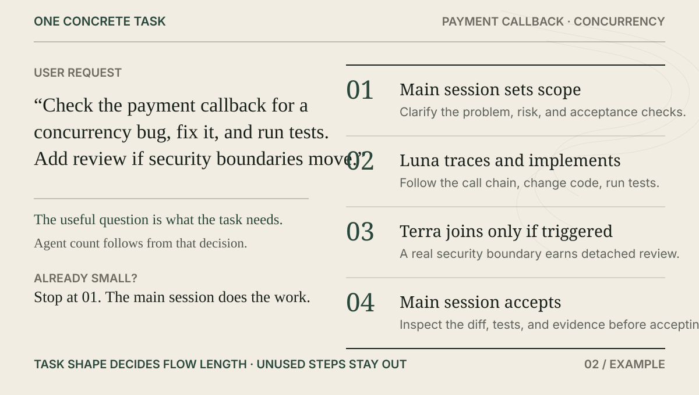

# Codex Agent Team

<p align="center">
  
</p>

<p align="center">
  <a href="README.md">中文</a> ·
  <a href="docs/plugin-installation.md">Install</a> ·
  <a href="docs/architecture.md">Architecture</a> ·
  <a href="docs/behavioral-evals.md">Evals</a>
</p>

Codex can already create Subagents. The harder part is deciding when to split a task, which specialist to use, who may write to the workspace, when an independent review is worth the cost, and who accepts the result.

Codex Agent Team turns those choices into a small set of rules. You keep working in the current main session. Small work stays there. When delegation has a concrete payoff, Luna, Terra, or Sol takes a clearly bounded responsibility, and the result comes back to the main session for acceptance.

## Install in 30 seconds

Add this repository marketplace to Codex:

```bash
codex plugin marketplace add R-jed/codex-agent-team --ref main
```

Reopen the ChatGPT desktop app, install `Codex Agent Team` from its marketplace in the Plugins Directory, then invoke it explicitly when you want to:

```text
/codex-agent-team
```

You can also just describe the job:

```text
Check the payment callback for a concurrency bug, fix it, and run the tests. If the change crosses a security boundary, add an independent review.
```

The Skill decides whether delegation actually helps.

## One concrete example

<p align="center">
  
</p>

A task like this normally starts in the main session. Heavy tracing or bounded implementation can move to Luna. Terra joins only when the change is risky enough that a detached review improves acceptance confidence. If the task is already small and isolated, it simply stays in the main session.

Sol is rare. It is reserved for unresolved high-consequence judgment after explicit user consent.

## What the Skill actually manages

Codex already provides the native `spawn_agent` primitive. Codex Agent Team manages the policy above it:

| Decision | Default rule |
| --- | --- |
| Should this task be delegated? | Keep it in the main session unless delegation has a concrete benefit |
| Who explores and implements? | Luna |
| When is a second view useful? | Use Terra for risky changes where detached judgment matters |
| Who may write to one workspace? | At most 1 active Writing Worker |
| When can Sol be used? | Only for unresolved high-consequence judgment after consent |
| Who accepts the work? | The main session checks files, diffs, commands, tests, and evidence |

<p align="center">
  
</p>

Zero Subagents is a normal outcome. Most tasks should not traverse the full chain.

## Four roles

<p align="center">
  
</p>

| Role | Default route | Main responsibility |
| --- | --- | --- |
| Main session | current Codex session | understand intent, set scope, own risk, accept work, deliver the final answer |
| Luna | GPT-5.6 Luna `max` | search, code tracing, bounded implementation, debugging, tests |
| Terra | GPT-5.6 Terra `xhigh` | detached review of risky changes, conflicting evidence, and key assumptions |
| Sol | GPT-5.6 Sol `high` | rare unresolved high-consequence judgment after user consent |

Luna has explorer and worker profiles. Terra is a reviewer, not an implementation fallback. Sol does not sit at the end of every task.

## What you see

When real delegation happens, or when an orchestration check materially changes execution, the Skill adds a compact receipt:

```text
Agent Team
Luna Worker: implemented bounded auth refresh change
Terra Reviewer: triggered by security boundary; verdict clear
Verification: 38 tests passed
```

When the main session handles the task directly:

```text
Agent Team: Main session only
Why: change already isolated; delegation had no concrete benefit
Verification: 12 tests passed
```

The receipt reports observed facts only. Agents that were considered but never created are omitted, and runtime evidence is never claimed when it was not observed.

## Safety boundaries

- Zero Subagents is normal, the default is 1, and the normal maximum is 2.
- There is at most one active writing Worker per shared workspace.
- Workers do not create another Subagent team; delegation stays one layer deep.
- The Skill never silently switches the main session model or reasoning effort.
- If an exact route, permission boundary, or scope cannot be established, responsibility returns to the main session.
- A Subagent completion report is a claim. The main session still accepts the work from actual files, diffs, commands, tests, and reproducible evidence.

The project uses Codex native `spawn_agent`. There is no second Agent runtime, persistent task DAG, or background scheduler in this repository.

<details>
<summary>Why does first use check four Agent profiles?</summary>

Model-specific routes are pinned through four managed custom Agent profiles:

```text
luna_explorer
luna_worker
terra_reviewer
sol_judge
```

If a profile is missing, the Skill first shows the write scope and asks for permission. After approval, it installs and verifies only those four profiles plus their ownership manifest. It does not modify `config.toml`, MCP configuration, credentials, or unrelated Agent profiles.

The Skill then rechecks which roles are visible on the current `spawn_agent` surface. A fresh Codex task is needed only when role discovery has not refreshed yet.

</details>

## Documentation

Use the README for the normal workflow. Use these docs for implementation details:

- [Plugin installation and first run](docs/plugin-installation.md)
- [Architecture](docs/architecture.md)
- [Native Subagent Runtime](docs/native-subagent-runtime.md)
- [Model routing and evidence](docs/model-route-assurance.md)
- [Runtime Evidence](plugins/codex-agent-team/skills/codex-agent-team/references/runtime-assurance.md)
- [Compatibility](docs/compatibility.md)
- [Behavioral Evals](docs/behavioral-evals.md)
- [OpenAI References](docs/openai-references.md)
- Policy: [Routing](plugins/codex-agent-team/skills/codex-agent-team/references/routing-policy.md) · [Safety](plugins/codex-agent-team/skills/codex-agent-team/references/safety-policy.md) · [Consent](plugins/codex-agent-team/skills/codex-agent-team/references/consent-policy.md)

## Current validation scope

CI covers Plugin packaging, the custom-Agent installer lifecycle, routing policy, runtime evidence, and the deterministic verifier on Ubuntu Python 3.11 / 3.12 and macOS Python 3.11. Real Codex behavior still requires live behavioral evaluation and runtime evidence; repository tests are not presented as runtime results.

## License

[MIT](LICENSE)
