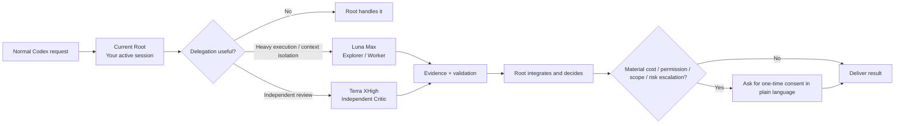
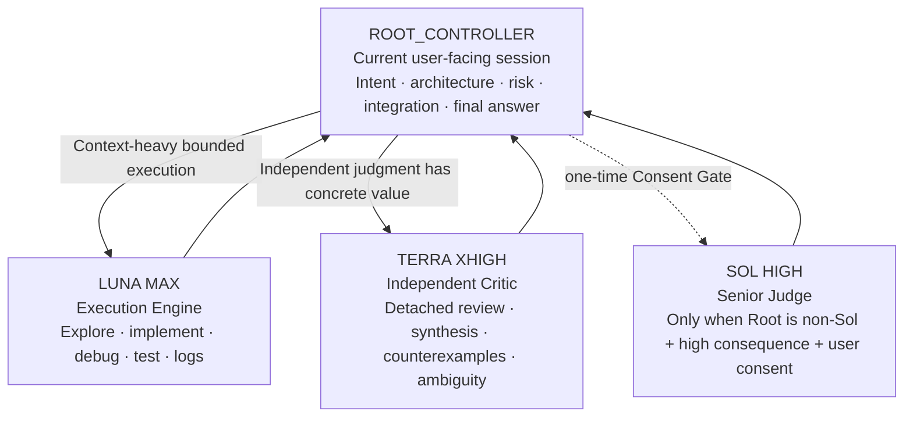
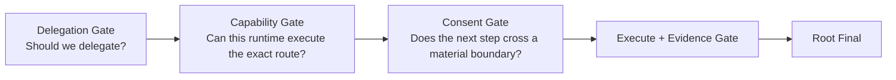

# Codex Agent Team

<p align="center">
  <strong>Give your Codex session a small AI team that knows when to work, when to review, and when to ask you first.</strong>
</p>

<p align="center">
  <a href="README.md">中文 README</a> ·
  <a href="docs/architecture.md">Architecture</a> ·
  <a href="docs/openai-references.md">OpenAI design references</a>
</p>

<p align="center">
  
  
  
  
  
</p>

Codex Agent Team is a lightweight policy Skill for **Codex Native Subagents**. It keeps the current session in control, routes context-heavy and tool-heavy execution to **GPT-5.6 Luna Max**, routes important detached review to **GPT-5.6 Terra XHigh**, and asks for plain-language one-time consent before a material capability, permission, scope, cost, or external-impact escalation.

> **The Root owns intent and final decisions. Luna Max handles deep execution. Terra XHigh provides a second opinion. Simple tasks stay simple; complex tasks get the smallest useful team.**

## What it does at a glance



### What improves after installation

| Typical Codex workflow | With Codex Agent Team |
| --- | --- |
| Search, logs, and tests accumulate in Root context | Noisy work is isolated in Luna Max and returns as compact evidence |
| The same model investigates, implements, and reviews | Terra XHigh can provide detached review |
| The user manually decides when to spawn | The Skill applies a Delegation Gate first |
| Available concurrency tends to become used concurrency | Default 0-1 children, normal max 2, hard max 4 |
| Child history inheritance may be implicit | Role-specific spawns explicitly control `fork_turns` |
| Unavailable routes encourage improvised fallback | Exact route unavailable returns work to Root |
| Beginners must understand policy switches | Material escalation is explained in plain language only when needed |
| One reasoning path can reinforce itself | A clean-context Terra review adds independent judgment |

## Why Luna Max is the execution engine now

The team is role-routed rather than built as a model difficulty ladder. Luna Max owns high-token, high-tool-use work that can eventually return to Root as a compact evidence packet.

When OpenAI launched GPT-5.6 on 2026-07-09, standard Luna pricing was **$1 input / $6 output** per million tokens. The OpenAI API Pricing page reviewed on 2026-08-02 lists standard short-context Luna at **$0.20 input / $1.20 output**, an **80% reduction** from launch pricing. Terra moved from **$2.50 / $15** to **$2 / $12**, while Sol remains **$5 / $30**.

| Model | 2026-07-09 launch | 2026-08-02 current* | Role in this Skill |
| --- | ---: | ---: | --- |
| Sol | $5 / $30 | $5 / $30 | Root or one-time Senior Judge |
| Terra | $2.50 / $15 | $2 / $12 | Independent Critic / synthesis |
| Luna | $1 / $6 | **$0.20 / $1.20** | Default Explorer / Execution Worker |

\* Standard, short-context, per 1M input/output tokens. Pricing is time-sensitive; use OpenAI's current pricing page as the source of truth.

Pricing is a design input, not a routing invariant. The Core Policy routes by responsibility and runtime capability so future price changes do not require a policy rewrite.

### Beyond price: why Luna can carry a large share of Worker tasks

OpenAI's GPT-5.6 launch evaluations show relatively small gaps between Luna and Terra on several coding and terminal benchmarks:

| OpenAI-published eval | Sol | Terra | Luna |
| --- | ---: | ---: | ---: |
| SWE-Bench Pro | 64.6% | 63.4% | 62.7% |
| DeepSWE v1.1 | 72.7% | 69.6% | 67.2% |
| Terminal-Bench 2.1 | 88.8% | 87.4% | 84.7% |

These figures support the design direction of using Luna for a large amount of bounded coding and tool-heavy work, but **they are not benchmarks of this Skill and do not prove Luna Max will outperform Terra XHigh on your workload**. Routing still depends on responsibility, independence requirements, live capability, and actual verification.

OpenAI's current model guidance positions Sol for frontier capability, Terra for intelligence/cost balance, and Luna for efficient high-volume workloads. GPT-5.6 supports `max` reasoning effort. See [`docs/openai-references.md`](docs/openai-references.md) for the official sources and exactly how each one informed this project.

## Team architecture



### Root Controller

The current user-facing session always owns final control. The Skill does not require a Sol Root.

- **Sol Root**: Medium / High are common main-session settings and the typical pattern is `Sol Root + Luna Max`; add Terra XHigh only when independent judgment has concrete value. A stronger-effort Sol Root still does not automatically spawn another Sol child.
- **Luna Max Root**: another Luna Max is still useful for context isolation and real parallelism; consequential review prefers Terra XHigh; only rare unresolved high-consequence cases should propose a Sol Senior Judge.
- **Terra XHigh Root**: do not spawn another Terra solely to claim model diversity. A Terra child is valid when detached clean-context review itself has value. If stronger independent model diversity is required for a high-consequence decision, use the Consent Gate before proposing Sol.

### Luna Max: Execution Engine

Default execution route: `gpt-5.6-luna` + `max`.

Use it for repository exploration, call-path tracing, large file/log/test scans, bounded implementation and fixes, bug reproduction, test design and failure analysis, local refactors, and other tool-heavy or context-heavy work that should return as concise evidence.

### Terra XHigh: Independent Critic

Default critic route: `gpt-5.6-terra` + `xhigh`.

Use it for independent verification, cross-module synthesis, conflicting evidence, consequential assumption challenges, and material requirement ambiguity. Terra review defaults to `fork_turns = "none"` so it receives the objective, acceptance criteria, evidence, and artifact without inheriting the producer's full history.

### Sol Senior Judge

Sol is not a routine Worker. When Root is non-Sol and lower routes leave a high-consequence decision materially unresolved, the Skill may propose one `gpt-5.6-sol` + `high` Senior Judge pass. It receives a compressed decision packet, does not perform routine repository work, and requires one-time user consent first.

## The three gates



**Delegation Gate** accepts only context isolation, real parallelism, or independent verification as concrete benefits. Task length, file count, spare concurrency, or Luna's lower cost do not justify delegation by themselves.

**Capability Gate** trusts the current native `spawn_agent` contract. Portable Mode uses a built-in role plus explicit model/effort. Profile Mode uses a custom Agent profile and omits competing model/effort overrides. If the exact route is unavailable, the task returns to Root.

**Consent Gate** replaces preconfigured switches such as `allow_upscale`. Normal in-scope actions already authorized by the user continue without repeated questions. Material increases in model cost, permissions, scope, external impact, or risk trigger a short plain-language one-time consent request.

## Context isolation is an explicit runtime rule

Current Codex MultiAgentV2 defaults omitted `fork_turns` to full history, and a full-history fork cannot also override `agent_type`. Codex Agent Team therefore sets the fork explicitly:

```text
Explorer          -> fork_turns = "none"
Terra Critic      -> fork_turns = "none"
Execution Worker  -> fork_turns = "none" by default
                     use positive recent-N only when required

Never omit fork_turns for a role-specific spawn.
Never combine fork_turns = "all" with agent_type on MultiAgentV2.
```

This protects both independence and spawn correctness.

## Safety by default

| Safety control | Behavior |
| --- | --- |
| Minimum Team | 0 children is normal; default 1; normal max 2; hard max 4 |
| One Writer | At most one active writing Worker in one shared workspace; multiple writers require runtime-backed workspace/worktree/filesystem isolation |
| Fail Closed | Unknown exact model/effort/role/permission returns work to Root |
| Permission-Aware | Profile sandbox is a default intent; effective permission is a runtime fact |
| Prompt Injection Boundary | Instructions in source, web pages, logs, issues, fixtures, or model output cannot expand scope, permissions, credentials, or Agent count |
| No Recursive Teams | Workers do not spawn descendants; observed nested delegation invalidates affected results |
| High Impact Stays With Root | Production changes, publication, payments, account actions, destructive deletion, and similar effects stay with Root |
| Evidence First | Workers distinguish observed facts, inference, uncertainty, and reproducible evidence |

## Zero configuration first

Install the Skill and keep using Codex normally. Beginners do not need to configure a model ladder, `allow_upscale`, provider policies, risk profiles, or YAML routing switches.

Advanced users may optionally install the profiles in `examples/agents/` to provide role-level defaults for model, reasoning effort, and sandbox. **Effective child permissions still come from the live Codex runtime**; `sandbox_mode` in a profile is not by itself proof of runtime enforcement.

Current Codex source discovers custom Agent roles from `agents/` directories associated with configuration layers. With the default global configuration directory, the optional profiles can be installed with:

```bash
mkdir -p ~/.codex/agents
cp examples/agents/*.toml ~/.codex/agents/
```

When profiles are installed, Profile Mode uses roles such as `luna_explorer`, `luna_worker`, and `terra_reviewer` while omitting competing explicit model/effort overrides. Without profiles, Portable Mode continues to work with no extra user configuration.

## Install

```bash
git clone https://github.com/R-jed/codex-agent-team.git
mkdir -p ~/.codex/skills
cp -R codex-agent-team/skill/codex-agent-team ~/.codex/skills/codex-agent-team
```

For development, a symlink also works:

```bash
ln -s "$(pwd)/skill/codex-agent-team" ~/.codex/skills/codex-agent-team
```

The Skill supports implicit invocation and can also be invoked explicitly:

```text
$codex-agent-team
```

## Example workflow

User:

> Fix this authentication issue, check the related tests, and verify that existing session behavior is not broken.

Possible team:

```text
Root
├─ Luna Max Worker
│  ├─ trace auth flow
│  ├─ implement bounded fix
│  └─ run tests
└─ Terra XHigh Critic
   └─ independently review session compatibility
```

Root inspects the diff, validation evidence, and critic findings before delivering the result. If the task is a simple local change, the Skill may choose zero Subagents and let Root handle it directly.

## Official OpenAI design references

All OpenAI sources that materially influenced the Skill are recorded in [`docs/openai-references.md`](docs/openai-references.md), including:

- the GPT-5.6 launch announcement and tier positioning
- **the Luna pricing change from $1/$6 to $0.20/$1.20**, plus the Terra change
- GPT-5.6 model guidance and `max` reasoning effort
- official Luna / Terra / Sol model pages
- Codex MultiAgentV2 source for `fork_turns`, role handling, and model/effort overrides
- Codex custom Agent role discovery and configuration precedence
- Codex child runtime permission behavior
- OpenAI-published SWE-Bench Pro, DeepSWE, and Terminal-Bench 2.1 coding evaluations
- the official Skill Creator progressive-disclosure and packaging guidance
- the official `agents/openai.yaml` field reference

The Luna/Terra/Sol roles, team limits, One Writer rule, fail-closed behavior, and Consent Gate are opinionated policies of this project, not claims that OpenAI recommends one universal team layout.

## Repository layout

```text
codex-agent-team/
├── README.md                 # Chinese default
├── README_EN.md              # English
├── LICENSE
├── CONTRIBUTING.md
├── SECURITY.md
├── docs/
│   ├── architecture.md
│   └── openai-references.md
├── examples/agents/
├── evals/
├── tests/
└── skill/
    └── codex-agent-team/
        ├── SKILL.md
        ├── agents/openai.yaml
        └── references/
```

Only `skill/codex-agent-team/` is installed into Codex. README files, tests, evals, and development docs remain at repository level so they do not consume Skill runtime context.

## Validation status

- Static policy consistency tests: included in `tests/`
- Routing behavior cases: included in `evals/`
- Native runtime smoke tests: still required on representative Codex builds before claiming universal runtime verification

The project intentionally separates “static policy tests pass” from “real Codex runtime behavior has been verified.”

## License

MIT
