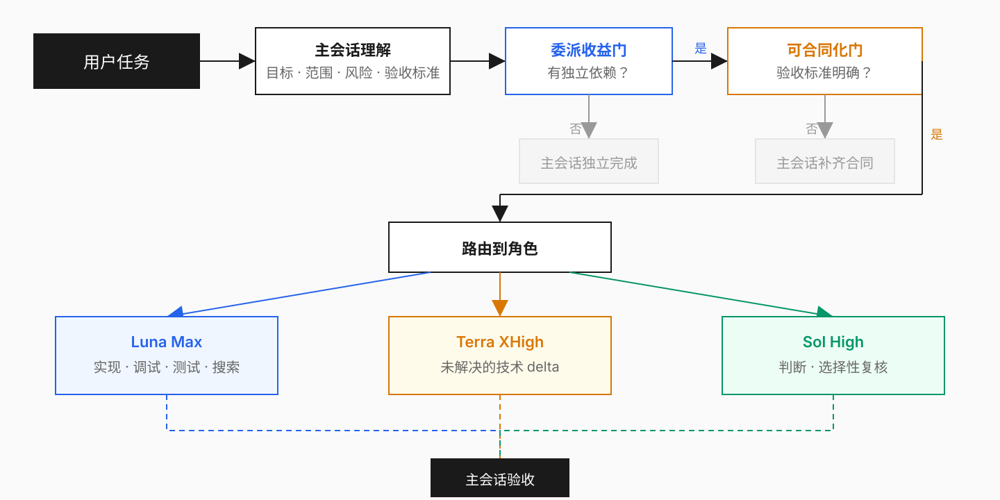
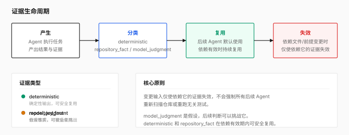
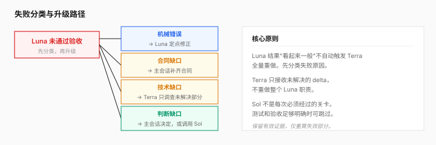

# Codex Delegate

<p align="center">
  <picture>
    <source media="(prefers-color-scheme: dark)" srcset="docs/logo-dark.svg">
    <source media="(prefers-color-scheme: light)" srcset="docs/logo-light.svg">
    
  </picture>
</p>

<p align="center">
  Get coding tasks done with the smallest useful set of Agents.<br>
  <a href="README.md">中文</a> · <a href="docs/plugin-installation.md">Installation</a> · <a href="LICENSE">MIT License</a>
</p>

<p align="center">
  <a href="LICENSE"></a>
  
  
</p>

Codex Delegate is a native Subagent delegation framework for Codex. You describe the engineering task, the current session decides what's worth delegating, who should handle it, and how to verify the result.

## Quick start

```bash
codex plugin marketplace add R-jed/codex-agent-team --ref main
```

Install `Codex Delegate` from the Plugins Directory in ChatGPT Desktop, then give it a task:

```text
/codex-delegate Fix this login retry bug and run the relevant tests.
/codex-delegate Refactor this module while preserving the public API.
/codex-delegate Review this change with emphasis on data consistency and regression risk.
```

No manual model selection. Codex Delegate figures out what's needed.

## How it works

The main session understands the task, then picks the smallest useful execution path.

<picture>
  <source media="(prefers-color-scheme: dark)" srcset="docs/architecture-diagram.svg">
  <source media="(prefers-color-scheme: light)" srcset="docs/architecture-diagram.svg">
  
</picture>

| Role | Model | Purpose |
| --- | --- | --- |
| Main session | current Codex session | understand task, decisions, scheduling, acceptance |
| Luna Reader | GPT-5.6 Luna `max` | search, test mapping, evidence collection |
| Luna Worker | GPT-5.6 Luna `max` | implementation, debugging, tests, local refactors |
| Terra Investigator | GPT-5.6 Terra `xhigh` | resolve complex technical dependencies |
| Sol Advisor | GPT-5.6 Sol `high` | judgment and selective review |

## Delegation flow



There is no fixed three-model pipeline. Every Subagent call must satisfy a distinct dependency that existing evidence does not already cover.

## Delegation contracts

Before a writing task starts, the main session compiles a verifiable Delegation Contract:

- What outcome must exist
- What may be read and written
- What behavior must remain unchanged
- What the Worker may decide independently
- What counts as acceptance
- Which verification must run
- When the Worker must stop and return control

A Writing Worker does not start guessing through repository changes when acceptance criteria are unclear.

## Established evidence is reused



The main session keeps valid test results, interface facts, and other evidence. Later Agents reuse those facts directly. Only evidence affected by changed files needs revalidation.

## Failure handling



When Luna needs help, the workflow classifies the failure before escalating. A mediocre Luna result does not automatically trigger a full Terra restart. Sol is also selective — when tests and acceptance criteria are strong enough, the main session can accept without adding a mandatory review stage.

## Parallelism

```
default: 0 Subagents (a normal outcome)
typical: 1
normal maximum: 2
v1 hard maximum: 4
```

Independent projects may each run their own Codex Delegate workflow. For writing work, ownership is workspace-scoped: one shared checkout should have at most one active Writing Worker.

## First run

Codex Delegate uses four project-managed Agent profiles:

```text
codex_agent_team_reader
codex_agent_team_worker
codex_agent_team_investigator
codex_agent_team_advisor
```

These profile identifiers are retained for compatibility and do not change the `/codex-delegate` entry point.

If they are missing, the Skill explains the exact managed file scope and asks for permission before provisioning. The installer manages only these four profiles and its ownership manifest. It does not edit credentials, MCP configuration, repositories, or unrelated Agent profiles.

If provisioning succeeds but the current task still does not expose the new role, start a fresh Codex task and invoke `/codex-delegate` again.

## Safety boundaries

- The main session retains task scope, consequential decisions, and final acceptance
- One shared checkout should have at most one active Writing Worker
- Child Agents do not create further Subagents; delegation stays one layer deep
- The Skill does not silently switch the main-session model or reasoning effort
- If an exact project profile is unavailable, the affected responsibility returns to the main session instead of silently using a similar role
- A Worker preserves unrelated user or concurrent-session edits; if workspace drift invalidates the contract, it should stop and return the changed state to the main session
- A Subagent completion report is a claim — final acceptance is based on actual files, diffs, tests, and reproducible evidence
- Publishing, deployment, payments, account-permission changes, and other consequential external actions remain under main-session control

## Current release status

Version `0.4.0` adopts the `Codex Delegate` product name and `/codex-delegate` entry point. The repository, Plugin package, and Agent profiles retain compatibility identifiers during the pre-v1 window.

Before v1.0.0, the project is still validating concurrent multi-session writes and profile provisioning.

## More information

- [Installation and first run](docs/plugin-installation.md)
- [Project homepage](https://github.com/R-jed/codex-agent-team)

## License

[MIT](LICENSE)
